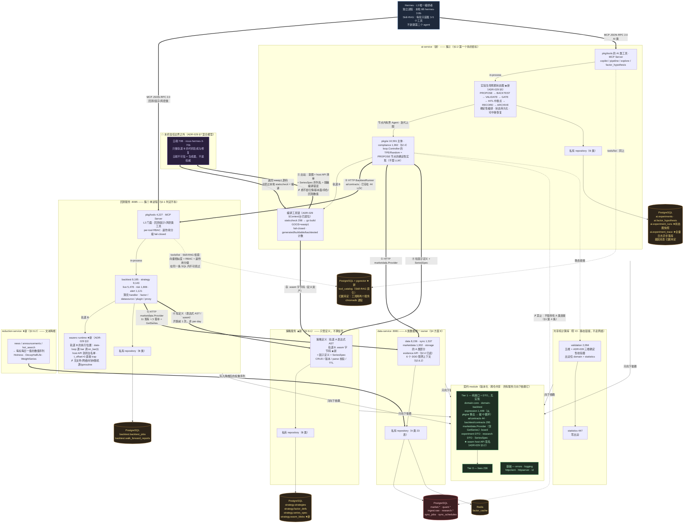

# ADR-027: 模块化拆分 — 独立仓库 / 独立服务的边界、契约与数据归属

> **Status**: Proposed —— **落地顺序调整（2026-10-08）**：先做**进程内核模块化**（[design/kernel/target-architecture-modular-kernel.md](../design/kernel/target-architecture-modular-kernel.md) 分期 P0–P2，把 11 个模块的边界 / 契约在**进程内**划清并冻结），本 ADR 的**服务拆分（5→7）在其后**。两者同一方向（划清模块边界、明确数据归属）；进程内核的模块边界契约是服务拆分的直接输入。
> **Date**: 2026-10-06（§2.6 与 §Context⑫⑬⑭ 为同日三轮头脑风暴追加）
> **Category**: Architecture
> **Related**: [ADR-023](adr-023-ai-experimenter-lab.md) · [ADR-024](adr-024-expression-as-execution-target.md) · **[ADR-028](adr-028-tiered-extension-of-strategy-expression-capability.md)（配套：028 定表达能力，本 ADR 定资产住哪个进程）** · **[ADR-029](adr-029-ai-layer-2026-agent-practice-alignment.md)（配套：029 定 tools 门面协议、实验生命周期状态图、可观测性；本 ADR 定服务边界）** · [ADR-020](adr-020-engine-decomposition.md) · [ADR-008](adr-008-inter-service-comm.md) · [PRODUCT.md](../PRODUCT.md)
> **Supersedes (部分)**: [ODR-021](../archive/odr/odr-021-p1-15-service-merge-risk-execution.md) 的「容器数 7 → 5」结论 —— 见 §2.1，**risk + execution 的合并判断本身保留**，本 ADR 只在其之上重新划分服务边界。⚠️ §2.6 追加策略服务与 reduction-service 后，服务数变为 **5（compose 容器 7）**，方向与 ODR-021 相反，理由见「代价 / 限制」
> **Upstream**: 用户（若曦）2026-10-06 裁决 ——
> 前三项（拆分形态 / storage 处置 / 死数据管道）+ 三轮头脑风暴追加六项
> （延迟目标分层解决 / 因子注册表住策略服务 / 序列注册表 config 驱动 /
> 文本降维独立成服务且 data-service 按 DDD 拆 / 策略服务独立但只传定义 / 落文档新建 ADR-028）

---

## Context

### 触发点

当前仓库是一个 **78,595 行、91 个包、33 个模块组的单体 Go module**。ADR-023 定义了
三层模型（L3 AI 编排 / L2 能力 / L1 数据），但**这三层在代码里没有物理边界** ——
它们是同一个 module 里的目录约定，靠 `internal/repoguard` 的测试和 code review 维持。

用户提出的四个目标（2026-10-06 裁决，全选）：

1. **降低认知负担 / 可维护性**
2. **强制架构分层不被腐蚀**（约定 → 编译器强制）
3. **独立部署 / 独立伸缩**
4. **清理死代码 / 明确取舍**

目标形态：**拆成独立仓库 / 独立服务**（每个模块单独 repo 或单独可部署进程，走
HTTP/gRPC 契约，需要版本化契约与跨仓发布）。

### 实测现状（本研究的全部结论均基于源码取证，非文档转述）

**① `cmd/analysis` 不是「一个上帝服务」，是三种性质不同的东西被塞进一个进程。**

`registerRoutes` + `main.go` 共注册 **20 个职责域**，按耦合性质分三簇：

| 簇 | 域 | 判定依据 |
|---|---|---|
| **①回测核心** | backtest / walkforward / batch / datasource / risk / execution / alert loop | 四次**实例注入**（`engine.SetRiskManager` `SetLiveTrader` `SetStore` `SetDataAdapter`）+ `AlertHistory` 进程内 ring buffer 被 loop 与 HTTP 层共享同一指针 + walk-forward 每窗口需**独立 Engine 实例**（per-instance 缓存，因子缓存是「整体替换」语义） |
| **②AI 生成链路** | copilot / pipeline / explore | `CopilotService` **无共享状态**（LLM client / staticcheck / sandbox runner 都自己 new）；绑 Engine 的唯一纽带是 `contracts.BacktestRunner` **接口**，且 `pkg/ai/client/backtest_client.go` 已有 HTTP 实现 |
| **③只读薄壳** | compliance / evidence / strategy CRUD / factor / plugin / OpenAPI / proxy | `compliance` 最纯粹：`NewComplianceHandler(logger, defaultProfile, reporterCfg)` 三个参数全是 viper **值拷贝**，零 DB、零 Engine、零共享状态 |

**② `pkg/storage` 是共享数据访问单体，且是 DDL 唯一真相。**

19 files / 4,882 LOC / 37 张表的内联 `migrate()` 数组（`pkg/storage` 无子包，此为唯一口径）。
扫全部非测试 `.go` 的 SQL 语句，
**34 张表的 SQL 全在这一个包里**，只有 3 处例外自己写 SQL：`pkg/auth`（users /
audit_logs）、`pkg/ai/gene_pool`（factor_genes / strategy_genes）、`pkg/data`
（factor_cache / ingest.raw）。

**③ 文档声称的 schema 分区在源码里不存在。**

`postgres.go` 只有 **2 条** `CREATE SCHEMA`（`ingest`:280、`research`:293）。37 张表里
**只有 4 张带 schema 前缀**（`ingest.raw` + `research.{profile,conclusion,question}`），
其余 **33 张是裸表名，全部落在 `public`**。AGENTS.md §2/§7 写的
「`ingest.raw` / `market.*` / `quant.*` / `research.*` 各分区均已落盘」与源码矛盾 ——
`market` 与 `quant` 两个 schema **根本不存在**。

**④ `pkg/domain` 是唯一真·全局契约，但内部不干净。**

7 files / 1,128 LOC / **45 个导出类型** / 被 **105 个非测试文件**导入（含测试 218 个）。
（含子包口径为 10 files / 1,299 LOC。）三个关注点混在一起：
核心领域类型、回测 DTO、以及**基础设施配置**（`Config` / `DatabaseConfig` /
`RedisConfig` / `ServiceConfig` / `TushareConfig` / `StrategyConfig`）。另有
`corporate_action.go` 的 `ActionEngine` 是**行为**（复权计算引擎）而非 DTO。

**⑤ 层级倒置：`pkg/fees` 才是最底层契约。**

`domain/execution.go:3` import `pkg/fees`；`pkg/backtest/contracts` 也 import 它并直接
const-alias（`DefaultStampTaxRate = fees.DefaultStampTaxRate`）。两个契约包都依赖它，
但目录结构里看不出来。

**⑥ `pkg/ai ↔ pkg/strategy` 循环依赖，根因是两个包放错层。**

`pkg/ai/expression`（因子 DSL + AST，1,448 LOC）与 `pkg/ai/contracts`（44 LOC）被
`strategy/expression`(×3)、`strategy`(×1)、`tools/builtin`(×2)、`cmd/analysis`(×1)
同时依赖。按 ADR-024，表达式引擎是 **L2 执行载体基础设施**，不是 L3 AI 能力 ——
它被当成公共契约层用，却挂在 `pkg/ai` 下面。

**⑦ 死数据管道：11 张表持续被写入，零 SQL 读取。**

`realtime_quote` `ohlcv_minute` `capital_flow` `sectors` `stock_sector_map` `top_list`
`limit_up_pool` `announcements` `news` `hot_search` `global_ohlcv`

写入路径是 `bulk_insert.go:50-60` 的 `NewTableMapper()`，**真实消耗 tushare / 东财配额、
磁盘与同步时间**。唯一的「意图读者」`pkg/ai/factor`（`capital_flow.go:42` /
`sentiment.go:23` 的注释）**自己就是 `unwiredPackages` 12 个零消费者包之一** ——
双重死链。而 `bulk_insert_ddl_test.go` 的防漂移断言只保证「表在 DDL 里存在」，
**不保证「有人读」**，门禁看不见这个浪费。

**⑧ 结构性门禁有盲区：死代码可以替死代码打掩护。**

`NewReconciliationHandler`（`handlers_reconciliation.go:37`）与 `NewStockStateHandler`
（`handlers_stock_state.go:41`）**全仓零调用点** —— 既未在 `registerRoutes` 注册，也未被
任何测试构造。后果：`pkg/live/reconciliation` 与 `pkg/live/stockstate` 只被死代码导入，
所以不在 `unwiredPackages` 白名单里，`TestEveryPackageHasAConsumer` 顺利通过。
门禁查的是「有没有 import 者」，不查「import 者自己是否可达」。

**⑨ 已有两个成功范例证明契约下沉可行。**

`pkg/ai/contracts/contracts.go`（44 行）与 `pkg/backtest/contracts/contracts.go`（295 行）
都是**叶子契约包 + 类型别名**：只 import `pkg/domain` / `pkg/fees` / stdlib，父包用
`type X = contracts.X` 零成本别名再导出。这是 S7 系列（ODR-043）刻意做的，
也是本 ADR 拆仓库的技术模板。

**⑩ 方案 E 的一半已经实现。**

`pkg/marketdata/provider.go` 有完整的 `Provider` 接口（11 方法，含 `BulkLoadOHLCV` /
`GetTradingDays` / `CheckCalendarExists`），且五种实现全在：`httpProvider`（30s timeout
+ 3 次重试）、`postgresProvider`、`cachedProvider`（Redis 装饰器）、`inmemoryProvider`、
`RealtimeProvider`。而 `buildBacktestEngine` **已经在用 httpProvider**：

```go
dataServiceURL := v.GetString("data_service.url")   // 默认 http://localhost:8081
httpProvider := marketdata.NewHTTPProvider(dataServiceURL, logger)
engine, err := backtest.NewEngine(v, httpProvider, logger)   // ← 引擎吃的是 HTTP provider
```

残留的是**双通道**：`buildDataServices` 又建了 `pgProvider` 塞进
`NewDataAdapter(nil, pgProvider, httpProvider, logger)`，且 engine 内部有 **6 处绕过
Provider 抽象直连 store** 的批量预取。

**⑪ 窄接口已经就位，但 DTO 住在实现层 —— 解耦只做了一半。**

仓库已经养成「定义窄接口、让实现可替换」的好习惯，问题是**接口签名的参数类型仍然
住在 `pkg/storage` 这个 DB 实现包里**，所以窄接口没有真正切断依赖。两个同型实例：

`pkg/ai/pipeline/pipeline.go` —— 注释（:83）明写「用接口而非 `*storage.PostgresStore`」，
也确实定义了 `ExperimentSink` 接口：

```go
InsertExperiment(ctx context.Context, e *storage.Experiment) (int64, error)
UpdateExperiment(ctx context.Context, id int64, u storage.ExperimentUpdate) error
CompleteExperiment(ctx context.Context, id int64, m *storage.ExperimentMetrics, errMsg string) error
```

接口对了，但签名里的 `storage.Experiment` / `ExperimentUpdate` / `ExperimentMetrics`
以及 `DatasetSplit*` / `ExperimentStatus*` 常量全在 storage。结果是 **L3 编排层为了写
一条实验日志，必须 import 整个 DB 实现包**（`pipeline.go:20` + `loop.go:18`，后者
全文件只用到 `storage.DatasetSplitTrain` 一个常量）。

`pkg/tools/builtin/research_tool.go` 是**完全同一个病灶的第二实例**：定义了
`ResearchProfileClient` 窄接口（:78，注释同样写着「`*storage.PostgresStore`」），
但返回类型 `*storage.ResearchProfile` / `[]storage.ResearchConclusion` /
`[]storage.ResearchQuestion` 仍在 storage（:277 / :459 / :476）。

**这不是架构违规，是契约放错位置。** 它把 §3 的 Tier 1 契约层从抽象原则变成了具体
清单：这两组 DTO（实验日志 + research 投影）必须搬进契约 module，否则 ai-service
永远无法在不 import storage 的前提下编译。

**⑫ 三套并存的数据抽象，其中两套生产零接线。**

| 抽象 | 形态 | 生产状态 |
|---|---|---|
| `marketdata.Provider`（11 方法） | 请求 / 响应，批量拉取 | ✅ **唯一在用的** |
| `marketdata.EventBus` + `DataEvent`（6 种 EventType）+ `BackpressureBus` | 发布 / 订阅，带背压 + metrics | ❌ **生产零接线** |
| `live.DataFeed`（`Subscribe` / `GetQuote` / `SetCallback`） | 回调式 Quote 流 | ❌ **生产零调用方** |

`EventBus` 的实现是**完整的**：6 种 EventType（ohlcv / fundamental / trade_cal / error /
source_switch / batch_done）、异步 worker 池、`PublishSync`、优雅 `Close()`，另有带背压的
`BackpressureBus`（含 `SubscriberCount` metrics）。但全仓 grep `NewEventBus(` 与
`.Publish(` **只命中 `_test.go`**；生产唯一调用点是 `setup.go:385`：

```go
dataAdapter := marketdata.NewDataAdapter(nil, pgProvider, httpProvider, logger)
//                                       ^^^^ EventBus 传 nil
```

且 `adapter.go:139` 的 `StartRealtime` 是 stub（`"not yet implemented — requires
real-time data feed"`）。`live.DataFeed` 的唯一实现 `SimulatedDataFeed` 内部是
`time.NewTicker(1 * time.Second)` 轮询 —— **不是真事件流**；`LiveEngine` 生产零调用方
（AGENTS.md §14 已登记）。

**后果**：「历史与实时共用同一 event 接口」目前**不存在** —— 有的是三套抽象、两套死的。
另外 `DataEvent{Type, Symbol, Timestamp, Payload}` **没有字段标注数据来自历史回放还是
实时**，而回测必须保证不收未来数据，这是个语义缺口。

**⑬ 策略服务的 HTTP 回退路径是 per-day 的，不是 per-run。**

`engine.go:1118-1125` 的 `getSignals` 已是两级分派：先查 `strategy.DefaultRegistry`
（in-process），查不到才 fallback 到 `getSignalsFromStrategyService`（HTTP）。
但那个 HTTP 调用**在日循环内部**，且 body 带整个股票池的完整 K 线
（`engine.go:1241-1253`）：

```go
MarketData  map[string][]domain.OHLCV       `json:"market_data"`
Fundamental map[string][]domain.Fundamental `json:"fundamental"`
```

5000 股 × 250 交易日 = **250 次全市场 K 线 JSON 序列化传输**。

⚠️ 这**限定**了 §5 第 5 步下面那句「engine 的 6 处直连全是 per-run 批量预取，
不是 per-bar」—— 那句是关于 **storage 直连**的，仍然成立；但**策略服务这条 HTTP 边是
per-day 的**，本研究初判时漏了。它不改变方案 E 的结论（storage 那 6 处确实是批量的），
但**改变了「策略服务能不能承载信号计算」的判断** —— 见 §2.6。

**⑭ AI 编排层与回测 / 实盘层在代码层面已经分离。**

`pkg/ai` 之外引用 `pkg/ai` 的生产文件只有 **23 处，集中在 3 个组**：
`pkg/strategy`(4) · `pkg/tools`(7) · `cmd/analysis`(12)。
**`pkg/backtest` / `pkg/live` / `pkg/risk` / `pkg/validation` / `pkg/marketdata` /
`pkg/data` / `pkg/storage` / `pkg/compliance` / `pkg/alert` 全部零命中。**

依赖方向是单向的 `ai → backtest`（经 `contracts.BacktestRunner` 接口），从来不是反向。
`pkg/strategy` 那 4 处全部指向 `ai/expression`(×3) + `ai/contracts`(×1) —— 按 ADR-024
它们是**执行载体基础设施**，不是 AI 能力，只是放错了目录（§5 第 3 步移出即断）。

**所以「回测 / 实盘层能否脱离 AI 人工手动使用」的答案是：能，且现在就能。**
人工路径完整存在 —— `POST /api/backtest`（不经 AI）、`pkg/strategy/plugins/` 的
**12 个人工编写内置策略**（momentum / mean_reversion / multi_factor / value /
value_screen / quality / risk_parity / sentiment / event_driven / convertible_bond /
new_strategies / example_plugin）、`strategy.GlobalRegister` 运行时注册、
`defaultSignalExpression()` 的 **7 个意图类型全部有确定性默认表达式（不调 LLM）**。
ADR-023「编排者只有一个」的另一面就是：**AI 是唯一编排者，但不是唯一入口。**

---

## Decision

### 1. 目标形态与四条不可协商的约束

每个模块成为**独立仓库 / 独立可部署进程**，跨进程走 HTTP 契约（沿用 ADR-008）。
但「拆」不是目的，下面四条是拆的过程中**不能丢**的东西：

| 约束 | 来源 | 拆分后如何保住 |
|---|---|---|
| **DDL 唯一真相** | AGENTS.md §9「绝不让同一份数据在两个位置各自存储」 | 真相载体从「一个 `migrate()` 数组」变成「**一个 schema = 一个 owner 服务**」（见 §4） |
| **编排者只有一个** | ADR-023 §2 | AI 服务独立后仍是唯一编排者；`tools`（L2 门面）**不拆**，见 §2.3 |
| **执行载体是表达式** | ADR-024 | `expression` 引擎归入契约层（Tier 1），不进 AI 服务私有 |
| **能力层拦住 AI 直接摸数据** | ADR-023 §2 | AI 服务**不得持有 A 类数据（行情 / 基本面 / 因子缓存）的连接**，取数只经 data-service HTTP；它**可以**持有自己 B 类业务状态（`experiments` / `factor_hypothesis`）的私有连接。ADR-023 拦的是 AI 绕过校验器直接摸**研究数据**并自行编造结论，不是拦它写自己的实验日志 |

### 2. 服务边界：三簇分治

#### 2.1 簇①「回测核心」保持单进程 —— ODR-021 的判断成立，不拆

`engine + riskManager + executionTrader + alertLoop + store + toolsRegistry` **必须同进程**。
四条源码级证据：

1. **四次实例注入**（非接口注入）—— `main.go:187-234` 的装配顺序不可重排：
   `SetRiskManager` → `SetLiveTrader` → `buildAlertSystem(同实例)` → `SetStore` →
   `SetDataAdapter`。
2. **`AlertHistory` 是进程内存共享**：`sync.RWMutex` + ring buffer，loop 与 HTTP 层
   共享同一指针（源码注释明写）。跨进程就得换成 Redis/PG，凭空引入一致性问题。
3. **风控与撮合在回测内环每笔调用** —— 这是 ODR-021 当初合并的理由，实测成立。
4. **`newEngine` 闭包要求每 walk-forward 窗口独立 Engine 实例**：引擎级缓存是
   per-instance 的，因子缓存是「整体替换」语义，窗口 B 的 Warm 会覆盖窗口 A 正在读的
   缓存。**Engine 的状态模型本身就不适合远端化。**

> 这不是「暂时不拆」，是**判定为不该拆**。ADR-023 的可监督性要求也支持这一点：
> 回测结果是 AI 实验员判断下一步的唯一依据，它的确定性不能建立在网络之上。

#### 2.2 簇②「AI 生成链路」独立为服务 —— 第一个拆的目标

`copilot + pipeline + explore` 独立成 **ai-service**。理由：

- **改动最小**：`CopilotService` 无共享状态；绑 Engine 的唯一纽带是
  `contracts.BacktestRunner` 接口，而 `pkg/ai/client/backtest_client.go` **HTTP 实现已存在**
  —— 拆分所需的客户端代码早就写好了，只是没被用。
- **伸缩需求根本不同**：LLM 调用是慢 IO + 高成本 + 需独立限流与预算控制；回测是
  内存密集 + CPU 密集。捆在一个进程里，两边的资源画像互相污染。
- **符合 ADR-023 分层**：L3 编排层本就该是独立进程（Hermes 已经是了）。

**前置**：需先完成 §3 的契约层（第 2、3 步），否则新仓要拖一份含 DB 配置的「领域包」。

**边界纪律**：ai-service **不持有 A 类数据的连接**（见 §1 第 4 条）。它的持久化只有
`experiments` / `factor_hypothesis`（自己的 B 类业务状态，走私有 repository），
取数一律经 data-service HTTP，跑回测一律经 ai-service → 回测服务的 `BacktestRunner`
HTTP 调用。

#### 2.3 `tools`（MCP bridge）不拆 —— 边界已经在正确位置

`buildToolsRegistry` 需要 8 组注入，其中三组是**本尊而非接口**：
`regimeDetector → riskManager`、`researchProfile → store`、`hypothesisStore → store`
（同一个传两次）。

它是 ADR-023 定义的 **L2 能力层门面**。拆出去就变成「分布式门面」—— 每个工具调用
多一跳，失败模式从 in-process error 变成网络超时 + 重试语义，而 ADR-023 明确要求
能力层「给定输入必有确定输出、可自动测试」。

**关键：它已经通过 `/api/tools/*` 对 Hermes 跨进程暴露**（带 per-tool RBAC，
按 `pkg/tools/sideeffect.go` 的副作用分级 fail-closed）。Hermes 是独立进程走 HTTP，
簇① 是 in-process。**这条线画对了，不要动。**

**「不拆」的准确含义（§2.5 图 B 画图时澄清）**：指的是**回测服务内的这个 L2 门面
不单独成服务**（否则每次工具调用平白多一跳），**不是**「全仓 21 个工具必须同进程」。
簇② 拆出 ai-service 后，AI 类工具（copilot / pipeline / explore / factor_hypothesis）
的 registry 随实现一起搬到 ai-service，并在那里暴露自己的 `/api/tools/*`；
Hermes 面对**两个 endpoint**（两个 base URL）。

**为什么不做「单一门面 + 转发到 ai-service」**：那会造成
`回测服务 → ai-service → 回测服务`（后者是 `BacktestRunner`）的**服务级循环**，
两跳网络超时叠加重试语义，正好是本节要避免的失败模式。分两份 registry 后，
跨服务调用只剩两个方向且无环。**ADR-023「编排者只有一个」不受影响** ——
Hermes 仍是唯一编排者。详见 §2.5 图 B 后的裁定说明。

#### 2.4 簇③「只读薄壳」按数据归属归位，不单独成服务

| 域 | 归属 | 理由 |
|---|---|---|
| `compliance` | 并入 ai-service 或留回测服务 | 零共享状态，但没有独立伸缩需求；单独成服务是过度拆分 |
| `evidence` | **data-service** | `citation = {source, dataset, key, as_of, content_hash}` 解析的是 `ingest.raw`，而 `ingest.raw` 归 data-service（§4） |
| `strategy CRUD` / `plugin` | **策略服务**（§2.6，独立成服务） | **前置**是 `strategy.GlobalPluginLoader` / `DefaultRegistry` 去全局化（§5 第 6 步）。ADR-012 里那个 standby 的 `cmd/strategy` **不是**这个服务，见 §2.6 |
| `factor` / `datasource` | 回测服务 | 依赖 `Engine` 实例。但**因子定义**归策略服务（[ADR-028](adr-028-tiered-extension-of-strategy-expression-capability.md) §6），这里只留求值与查询 |
| `proxy` | **保留并扩大** | 这是仓库里唯一现成的跨进程网关范式（`httputil.NewSingleHostReverseProxy` + `FlushInterval = -1` 支持 SSE），是拆分的落地模板 |

#### 2.5 模块连接图（AS-IS → TO-BE）

**测量口径**（可复现）：包组 = import 路径的**前两级**（`pkg/ai/pipeline` 归入 `pkg/ai`）；
只统计**非 `_test.go`** 文件；LOC 用 `Measure-Object -Line`。实测 **32 个生产包组 /
326 个非测试文件 / ≈78.6k LOC / 106 条组间依赖边**。原始 106 条中排除 19 条非生产边
（`.workbuddy-ai/tmp` 临时目录 17 条、根目录 `tools/warmcache_bench.go` benchmark 2 条），
下表与图使用剩余 **87 条生产边**。箭头上的数字 = **import 该组的文件数**，不是包数。

一处口径说明：`docs/embed.go`（10 LOC，OpenAPI 嵌入）**在图 A 里画为第 33 个节点**
（它有 1 条真实入边 `cmd/analysis → docs`，计入 87 条），但它不属于 `pkg/` `cmd/`
`internal/` 任何一类包组，故**不计入表 A 的 32 组**。表 A 与图 A 的边数一致，
节点数差 1，原因在此。

两处扫描误捕已剔除，记录在此避免后人重犯：`pkg/ai/prompts.go` 里出现的
`pkg/strategy` 是 **prompt 模板字符串文本**而非真 import；`pkg/storage → pkg/sync`
实为对 **`pkg/sync/types` 叶子类型包**的依赖（`storage/sync_jobs.go:9`），
不是依赖同步引擎。

##### 图 A — AS-IS 模块依赖全图（32 组 · 87 条边）

依赖方向一律向下（上层 import 下层）。边上的 `×N` = **import 该组的文件数**（仅标 ≥2
或病灶/循环边，完整数字见表 A）。

**图例**：`──►` 正常依赖 · `══►` 循环依赖（⟲）· `┄┄►` 病灶边（⚠，见表 B）
· <span style="color:#e8a33d">橙框</span> = 循环涉及组 · <span style="color:#e5484d">红框</span> = 病灶边端点
· 虚线灰框 = 零出边且零入边（完全孤立）

```mermaid
flowchart TD
    subgraph L4["L4 进程入口"]
        CMDA["cmd/analysis<br/>5,764 · 18 出边 · 上帝服务"]
        CMDD["cmd/data<br/>3,572"]
        CMDS["cmd/strategy<br/>296 · standby ADR-012"]
    end

    subgraph L3["L3 编排 / 门面"]
        TOOLS["pkg/tools<br/>4,227 · L2 能力层门面 21 工具"]
        AI["pkg/ai<br/>10,591 · L3 AI 编排"]
    end

    subgraph L2["L2 业务引擎"]
        BT["pkg/backtest<br/>9,195"]
        ST["pkg/strategy<br/>9,143"]
        LIVE["pkg/live<br/>5,478"]
        VAL["pkg/validation<br/>2,094"]
        COMP["pkg/compliance<br/>1,962"]
        RISK["pkg/risk<br/>1,806"]
        SBX["internal/sandbox<br/>1,653 · 零出边"]
        ALERT["pkg/alert<br/>1,121 · 零出边"]
    end

    subgraph L1["L1 数据管道 / 数据访问"]
        DATA["pkg/data<br/>8,156"]
        SYNC["pkg/sync<br/>1,537"]
        MD["pkg/marketdata<br/>1,932"]
        STORE["pkg/storage<br/>4,882 · DDL 唯一真相 37 表"]
        AUTH["pkg/auth<br/>773 · 零出边 + 自带 SQL pool"]
    end

    subgraph L0["L0 契约 / 基础"]
        DOM["pkg/domain<br/>1,299 · 入度 13 全仓最高"]
        DEC["pkg/decimal<br/>564 · 孤立"]
        STAT["pkg/statistics<br/>447 · 入度 6"]
        HS["internal/httpserver<br/>380"]
        OBS["pkg/observability<br/>309 · 零出边"]
        APIP["pkg/api<br/>297 · 孤立"]
        FEES["pkg/fees<br/>236 · Tier 0 · 零出边"]
        LOG["pkg/logging<br/>144 · 零出边"]
        ERR["pkg/errors<br/>136 · 零出边"]
        HC["pkg/httpclient<br/>136"]
        PORT["pkg/portfolio<br/>80"]
        IDP["pkg/id<br/>80 · 零出边"]
        SETTLE["pkg/settlement<br/>48 · 零出边"]
        DOCSE["docs/embed<br/>10 · OpenAPI 嵌入"]
    end

    TU["pkg/testutil<br/>257 · 测试专用"]

    %% ---- cmd/analysis 18 出边 ----
    CMDA -->|"×19"| HS
    CMDA -->|"×11"| AI
    CMDA -->|"×9"| BT
    CMDA -->|"×7"| DOM
    CMDA -->|"×7"| LIVE
    CMDA -->|"×6"| ST
    CMDA -->|"×5"| AUTH
    CMDA -->|"×4"| RISK
    CMDA -->|"×4"| STORE
    CMDA -->|"×4"| TOOLS
    CMDA -->|"×3"| ALERT
    CMDA -->|"×3"| DATA
    CMDA -->|"×3"| OBS
    CMDA -->|"×2"| COMP
    CMDA -->|"×2"| SBX
    CMDA --> MD
    CMDA --> VAL
    CMDA --> DOCSE

    %% ---- cmd/data 6 出边 ----
    CMDD -->|"×12"| DATA
    CMDD -->|"×10"| HS
    CMDD -->|"×9"| STORE
    CMDD -->|"×7"| LOG
    CMDD -->|"×4"| DOM
    CMDD --> SYNC

    %% ---- cmd/strategy 3 出边 ----
    CMDS -->|"×2"| ST
    CMDS --> DOM
    CMDS --> HS

    %% ---- internal/httpserver ----
    HS --> ERR

    %% ---- pkg/tools 4 正常出边（第 5 条 storage 是病灶，见末尾）----
    TOOLS -->|"×7"| AI
    TOOLS -->|"×4"| DOM
    TOOLS -->|"×2"| ST
    TOOLS --> RISK

    %% ---- pkg/backtest 12 出边 ----
    BT -->|"×17"| DOM
    BT -->|"×5"| MD
    BT -->|"×5"| STORE
    BT -->|"×4"| FEES
    BT -->|"×3"| ERR
    BT -->|"×3"| LIVE
    BT -->|"×3"| STAT
    BT -->|"×2"| RISK
    BT --> HC
    BT --> PORT
    BT --> SETTLE
    BT --> ST

    %% ---- pkg/strategy 4 正常出边（第 5 条 ai 是循环，见末尾）----
    ST -->|"×25"| DOM
    ST -->|"×8"| STAT
    ST --> DATA
    ST --> STORE

    %% ---- pkg/validation / pkg/compliance ----
    VAL -->|"×5"| DOM
    VAL --> STAT
    COMP -->|"Board 枚举 + ClassifySymbol"| MD

    %% ---- pkg/live 6 出边 ----
    LIVE -->|"×9"| DOM
    LIVE -->|"×2"| FEES
    LIVE -->|"×2"| MD
    LIVE --> IDP
    LIVE --> PORT
    LIVE --> RISK

    %% ---- pkg/data 5 出边 ----
    DATA -->|"×8"| DOM
    DATA -->|"×5"| STORE
    DATA -->|"×3"| STAT
    DATA -->|"×2"| HC
    DATA -->|"×2"| LOG

    %% ---- pkg/marketdata 3 正常出边（第 4 条 storage 是病灶）----
    MD -->|"×6"| DOM
    MD -->|"×3"| ERR
    MD --> HC

    %% ---- pkg/risk 4 出边 ----
    RISK -->|"×5"| DOM
    RISK -->|"×5"| ERR
    RISK -->|"×3"| STAT
    RISK --> MD

    %% ---- pkg/sync / pkg/storage / pkg/httpclient / pkg/portfolio / pkg/testutil ----
    SYNC -->|"×4"| LOG
    STORE -->|"×8"| DOM
    STORE -->|"×2"| LOG
    STORE -->|"sync/types 叶子类型包"| SYNC
    HC --> LOG
    PORT --> FEES
    TU --> STORE

    %% ---- pkg/ai 5 正常出边（另 2 条是循环/病灶，见末尾）----
    AI -->|"×9"| DOM
    AI -->|"×5"| STAT
    AI -->|"×3"| DATA
    AI -->|"×2"| VAL
    AI --> FEES

    %% ==== 循环依赖（⟲ 2 条，表 B 第 2 行）====
    ST ==>|"×4 ⟲ 唯一非法边<br/>contracts ×1 + expression ×3"| AI
    AI ==>|"×8 ⟲ 合法方向"| ST

    %% ==== 病灶边（⚠ 4 条，表 B）====
    DOM -.->|"⚠ ×1 层级倒置"| FEES
    AI -.->|"⚠ ×2 实验日志 DTO 错位"| STORE
    TOOLS -.->|"⚠ ×1 research DTO 错位"| STORE
    MD -.->|"⚠ ×1 postgresProvider 双通道"| STORE

    classDef entry fill:#1e293b,stroke:#60a5fa,color:#e2e8f0
    classDef patho fill:#3d1f22,stroke:#e5484d,color:#fecdd3
    classDef cyc fill:#3d3319,stroke:#e8a33d,color:#fde68a
    classDef iso fill:#1f2937,stroke:#6b7280,color:#9ca3af,stroke-dasharray:4 4
    class CMDA,CMDD,CMDS entry
    class AI,ST cyc
    class STORE,DOM,FEES,MD patho
    class DEC,APIP iso
```



**这张图直接说明为什么 §5 的迁移顺序不可换**：

- `pkg/domain`（入度 13）与 `pkg/fees`（入度 5）位于全图最底部却**互相依赖**（红虚线）——
  不先把 `fees` 提为 Tier 0，`domain` 切三包时会切错边界（§5 第 1 步）。
- `pkg/ai ⟲ pkg/strategy` 是**全图唯一的循环**，且非法方向只有 4 条边、全部指向
  `ai/expression` + `ai/contracts` 两个子包 —— 移出即破环，零逻辑改动（§5 第 3 步）。
- `pkg/storage` 有 **9 个入边来源**（图上 6 条实线 + 3 条红虚线），是全图最密的汇聚点 ——
  这就是方案 E 必须炸开它的原因（§5 第 5 步）。
- `pkg/decimal` / `pkg/api` 虚线灰框：**零出边且零入边**，图上完全悬空（§5 并行清理）。
- `internal/sandbox` / `pkg/alert` / `pkg/auth` / `pkg/observability` 等 12 组零出边 ——
  抽成独立 module 无需改动自身一行代码。


##### 表 A — 完整组间邻接表（32 组 · 87 条边 · 按 LOC 降序）

「入度」= import 该组的**其他组数**。出边格式 `目标 ×文件数`。

| # | 包组 | LOC | 出边（→ 目标 ×文件数） | 入度 |
|---|---|---|---|---|
| 1 | `pkg/ai` | 10,591 | strategy ×8 ⟲ · domain ×9 · statistics ×5 · data ×3 · **storage ×2 ⚠** · validation ×2 · fees ×1 | 3 |
| 2 | `pkg/backtest` | 9,195 | domain ×17 · marketdata ×5 · storage ×5 · fees ×4 · errors ×3 · live ×3 · statistics ×3 · risk ×2 · httpclient ×1 · portfolio ×1 · settlement ×1 · strategy ×1 | 1 |
| 3 | `pkg/strategy` | 9,143 | domain ×25 · statistics ×8 · **ai ×4 ⟲** · data ×1 · storage ×1 | 5 |
| 4 | `pkg/data` | 8,156 | domain ×8 · storage ×5 · statistics ×3 · httpclient ×2 · logging ×2 | 4 |
| 5 | `cmd/analysis` | 5,764 | httpserver ×19 · ai ×11 · backtest ×9 · domain ×7 · live ×7 · strategy ×6 · auth ×5 · risk ×4 · storage ×4 · tools ×4 · alert ×3 · data ×3 · observability ×3 · compliance ×2 · sandbox ×2 · marketdata ×1 · validation ×1 · docs ×1 | 0 |
| 6 | `pkg/live` | 5,478 | domain ×9 · fees ×2 · marketdata ×2 · id ×1 · portfolio ×1 · risk ×1 | 2 |
| 7 | `pkg/storage` | 4,882 | domain ×8 · logging ×2 · sync/types ×1 | **9** |
| 8 | `pkg/tools` | 4,227 | ai ×7 · domain ×4 · strategy ×2 · risk ×1 · **storage ×1 ⚠** | 1 |
| 9 | `cmd/data` | 3,572 | data ×12 · httpserver ×10 · storage ×9 · logging ×7 · domain ×4 · sync ×1 | 0 |
| 10 | `pkg/validation` | 2,094 | domain ×5 · statistics ×1 | 2 |
| 11 | `pkg/compliance` | 1,962 | marketdata ×1 | 1 |
| 12 | `pkg/marketdata` | 1,932 | domain ×6 · errors ×3 · httpclient ×1 · **storage ×1 ⚠** | 5 |
| 13 | `pkg/risk` | 1,806 | domain ×5 · errors ×5 · statistics ×3 · marketdata ×1 | 4 |
| 14 | `internal/sandbox` | 1,653 | —（零出边） | 1 |
| 15 | `pkg/sync` | 1,537 | logging ×4 | 2 |
| 16 | `pkg/domain` | 1,299 | **fees ×1 ⚠** | **13** |
| 17 | `pkg/alert` | 1,121 | —（零出边） | 1 |
| 18 | `pkg/auth` | 773 | —（零出边，自带 SQL pool） | 1 |
| 19 | `pkg/decimal` | 564 | —（零出边） | **0** |
| 20 | `pkg/statistics` | 447 | —（零出边） | 6 |
| 21 | `internal/httpserver` | 380 | errors ×1 | 3 |
| 22 | `pkg/observability` | 309 | —（零出边） | 1 |
| 23 | `pkg/api` | 297 | —（零出边） | **0** |
| 24 | `cmd/strategy` | 296 | strategy ×2 · domain ×1 · httpserver ×1 | 0 |
| 25 | `pkg/testutil` | 257 | storage ×1 | 0（测试专用） |
| 26 | `pkg/fees` | 236 | —（零出边） | 5 ← **Tier 0** |
| 27 | `pkg/logging` | 144 | —（零出边） | 5 |
| 28 | `pkg/errors` | 136 | —（零出边） | 4 |
| 29 | `pkg/httpclient` | 136 | logging ×1 | 3 |
| 30 | `pkg/portfolio` | 80 | fees ×1 | 2 |
| 31 | `pkg/id` | 80 | —（零出边） | 1 |
| 32 | `pkg/settlement` | 48 | —（零出边） | 1 |

**从表 A 直接读出的四个结论**：

1. **12 个零出边组**（#14、17–20、22、23、26–28、31、32）是**天然的 Tier 0 / Tier 1 候选** ——
   它们不依赖任何业务包，抽出成独立 module 无需改动自身一行代码。
2. **`pkg/decimal` 与 `pkg/api` 零出边且零入边** —— 完全孤立，已在 `unwiredPackages`
   白名单里，属「先停写入、保留代码」同一类死资产（§5 并行清理）。
3. **`pkg/storage` 入度 9** —— 6 个业务组 + 3 个进程入口都直连它。这是方案 E 要炸开的
   真正原因：不切断这 9 条边，任何服务都无法独立部署。
4. **`pkg/domain` 入度 13 是全仓最高** —— 印证 §3「切三包 + 别名再导出」的必要性：
   它必须最先稳定下来，否则契约层每改一次，13 个下游全跟着改。

##### 表 B — 病灶边（精确到 file:line）

| 病灶 | 精确位置 | 性质 | 归属 |
|---|---|---|---|
| `domain → fees` 层级倒置 | `pkg/domain/execution.go:3` | 契约包依赖契约包，目录结构看不出来 | §5 第 1 步 |
| `ai ↔ strategy` 循环 —— **唯一非法边是 strategy → ai 方向的全部 4 处** | `pkg/strategy/copilot.go:16`（→ `ai/contracts`）<br>`pkg/strategy/expression/strategy.go:25`<br>`pkg/strategy/expression/signal.go:24`<br>`pkg/strategy/expression/data_provider.go:8`（后三条 → `ai/expression`） | 表达式引擎是 L2 执行载体（ADR-024），却挂在 `pkg/ai` 下 | §5 第 3 步 —— **移出这两个子包即零逻辑改动破环** |
| `ai → storage` DTO 错位 | `pkg/ai/pipeline/pipeline.go:20`（`ExperimentSink` 接口签名用 `storage.Experiment` / `ExperimentUpdate` / `ExperimentMetrics`）<br>`pkg/ai/loop/loop.go:18`（全文件只用 `storage.DatasetSplitTrain` 一个常量） | 窄接口对了，DTO 住错层 | §3 Tier 1 需新增**实验日志 DTO** |
| `tools → storage` DTO 错位（同病灶第二实例） | `pkg/tools/builtin/research_tool.go:78, 84, 277, 459, 476`（`ResearchProfile` / `ResearchConclusion` / `ResearchQuestion`） | 同上 | §3 Tier 1 需新增 **research 投影 DTO** |
| `marketdata → storage` 双通道 | `postgresProvider`（`buildDataServices` 里 `NewDataAdapter(nil, pgProvider, httpProvider, logger)`） | Provider 抽象被自己绕过 | §5 第 5 步删参数 |
| `storage → sync/types` | `pkg/storage/sync_jobs.go:9` | **非病灶** —— 叶子类型包，易被误读为「存储层依赖同步引擎」 | 仅需图注说明 |

##### 图 B — TO-BE 目标拓扑与数据流



**ADR-029 给这张图带来的六处变化**（原图的三服务 + 契约层骨架不变）：

| # | 变化 | 依据 |
|---|---|---|
| 1 | `HERMES → tools` 的协议从「HTTP `/api/tools/*`」改为 **MCP（JSON-RPC 2.0）**，且标注 **Skill-RAG 每轮只装载 3-5 个工具**（原为 21 个全量注入，配 8B 模型是实打实的伤害） | ADR-029 §4 §6 |
| 2 | ai-service 内新增 **实验生命周期状态图**（`SG`）作为编排层，`pkg/ai` 降为**状态图节点内的有界 Agent**；`loop.Controller` 的 TPE 成为 `PROPOSE` 节点的确定性实现 | ADR-029 §5 |
| 3 | **WASM 的编译与执行分处两个服务** —— 编译工具链（`BLD`）在 ai-service，**wazero runtime（`WRT`）在回测服务**。理由：host API 要逐 bar 喂数据，而数据在引擎的 date-loop 里；`.wasm` 字节码作为**定义资产**存策略服务 | ADR-029 §3 + §2.6.1 |
| 4 | 新增 **本机信任边界之外的云端 70B**（`LLM70`）与 **⑤ 出站边**，边上直接写明「给什么 / 绝不给什么」；返回的源码**必须过本地 staticcheck + 编译** | ADR-029 §7 |
| 5 | 新增 `PGT`（**pgvector** 的 `tool_catalog`，chromadb 退役）；`PGI` 补 `ai.experiment_runs`（状态图快照）与 `ai.experiment_trace`（全量日志异步落库，主 Agent 只读摘要）；`PGS` 补 `strategy.wasm_blobs` | ADR-029 §6 §8 |
| 6 | 原 `AIC` 节点里「sandbox 1,653（**代码 artifact 编译校验**）」的描述**已过时** —— 双轨下轨道 B 的 WASM **要执行**，不再只是 artifact。已拆成 `BLD`（编译）与 `WRT`（执行）两个节点 | ADR-029 §2 |

⚠️ **两处刻意没画进图里、但必须记录**：

- **`PGT` 的归属待定** —— 工具横跨回测服务与 ai-service 两个进程，`tool_catalog`
  归谁（各自注册到共享表 / 归策略服务 / 归 ai-service）需在实施前裁决。
  已登记在 ADR-029 §未解决
- **`HITL` 的通知渠道未定** —— 状态图中断后怎么通知实验室主任（飞书 / 邮件 / 前端红点）。
  已登记在 ADR-029 §未解决


**跳数标注**（哪些已存在、哪些要新建）：

| 标 | 跨服务调用 | 现状 |
|---|---|---|
| **①** | `marketdata.Provider` HTTP | **已存在** —— `buildBacktestEngine` 已在用 `httpProvider`（§Context⑩），需补 5 个方法 + 5 个端点（§5 第 5 步），**外加 1 个通用的 `GetSeries`**（[ADR-028](adr-028-tiered-extension-of-strategy-expression-capability.md) §5.1，用于按 SeriesSpec 读任意序列，避免每加一种数据源就改一次接口 × 5 个实现） |
| **②** | `BacktestRunner` HTTP | **已存在** —— `pkg/ai/client/backtest_client.go` 已实现，`pkg/ai/contracts` 44 LOC 就是它的契约 |
| **③**（未画） | ~~回测服务 tools 门面 → ai-service~~ | **刻意不做** —— 见下方「Hermes 直连两个 endpoint」的裁定 |
| **④** | 回测服务 / ai-service → **策略服务** 拉定义 | **新建**，但**开跑前 1 次**，不是 per-day。这是 §Context⑬ 那条 per-day HTTP 陷阱的正解：**传定义，不传信号**（§2.6.1）。轨道 B 下拉的是 `.wasm` 字节码 |
| **⑤** | ai-service → **云端 70B**（本机信任边界外） | **新建**，仅轨道 B 的代码生成/修复。**全图唯一跨信任边界的边**，出站内容白名单化 + 编译错误脱敏 + 回流必须过本地 staticcheck 与编译。见 [ADR-029](adr-029-ai-layer-2026-agent-practice-alignment.md) §7 |
| — | `Hermes → tools` 的**协议** | 由自定义 REST 改为 **MCP（JSON-RPC 2.0）**，且 `tools/list` 走 **Skill-RAG** 每轮只返回 3-5 个工具（原为 21 个全量注入）。**副作用分级与 per-tool RBAC 完整保留**，见 ADR-029 §4 §6 |

**画图过程暴露并当场裁定的一个设计问题：Hermes 直连两个 endpoint，而不是单一门面转发。**

如果坚持「所有 MCP 工具都挤在回测服务的 tools 门面里」，那么 AI 类工具调用必须
`回测服务 → ai-service`，而 ai-service 跑回测又要 `ai-service → 回测服务` ——
**产生服务级循环 A→B→A**，失败模式从 in-process error 变成两跳网络超时叠加重试语义，
且与 §2.3「能力层给定输入必有确定输出」直接冲突。

裁定：**按服务分两份 tools registry，Hermes 面对两个 endpoint**（回测/因子/风控类
走 `:8085/api/tools/*`，AI 类走 ai-service 的 `/api/tools/*`）。这不违反 §2.3 ——
「tools 不拆」的意思是**回测服务内的 L2 门面不单独成服务**（不额外多一跳），
不是「全仓所有工具必须同进程」。**ADR-023 的「编排者只有一个」依然成立**：
Hermes 仍是唯一编排者，只是它现在配置两个 base URL。这样跨服务调用只剩
`ai-service → 回测服务`（②）与 `两者 → data-service`（①）两个方向，**无环**。

**图 B 相对图 A 消灭的边**：`ai → storage`（→ Tier 1 experiment DTO + 私有 repo）、
`tools → storage`（→ Tier 1 research DTO）、`strategy → ai`（→ 双方共同依赖 Tier 1
`expression`）、`domain → fees`（→ 二者同入契约 module，倒置消失）、
`marketdata → storage`（→ data-service 内部私有，不再跨服务）。

**`pkg/validation` 为什么放进「共享纯计算库」而不是某个服务**：它的出边只有
`domain ×5` + `statistics ×1`（表 A #10），**零 IO、零 DB、零全局状态**，
是纯函数库。ADR-023 明确要求验证器是「被调用的确定性函数」而非第二个 agent ——
静态链接进 ai-service 恰好实现了这一点，且不引入网络跳。

**注**：`pkg/auth`（773 LOC · 零出边 · 自带 SQL pool）**已经是完全独立的模块形态**，
是剥离成本最低的一个。本 ADR 不做（§7「一次一个」），但它证明了目标形态可行。

##### 图 C — TO-BE 一次完整实验回路的数据流

ADR-023 的 L3 循环（挖因子 → 调参 → 跑回测 → 看结果 → 决定下一步）落到图 B
拓扑上的实际数据流：

```mermaid
sequenceDiagram
    autonumber
    participant H as Hermes L3 编排者（本地 8B）
    participant G as 状态图（ai-service · 确定性编排）
    participant A as PROPOSE 节点内的有界 Agent
    participant C as 云端 70B（信任边界外）
    participant V as VALIDATE 节点（validation 静态链接）
    participant T as 回测服务 tools 门面（MCP Server）
    participant W as wazero runtime（回测服务内）
    participant S as 策略服务（§2.6.1）
    participant D as data-service
    participant PG as PostgreSQL

    Note over H,PG: 一次实验回路 = 状态图的一轮（ADR-029 §5）<br/>外层确定性编排，节点内有界 Agent；①② 通道已存在

    H->>T: MCP tools/list（Skill-RAG 检索 3-5 个，非 21 个全量）
    T-->>H: 工具子集（向量相似度 + RBAC + 副作用分级，同一条 SQL）
    H->>G: MCP tools/call 触发一次实验
    G->>PG: 写 ai.experiment_runs（状态图快照 · 可中断恢复）

    rect rgb(30,41,59)
    Note over G,S: PROPOSE 节点 —— 节点内有界 Agent（迭代上限），上下文隔离
    G->>A: 派发任务（不继承主对话历史）
    A->>PG: 读 ai.factor_hypothesis（B 类）
    A->>S: HTTP ④ 拉因子定义 + SeriesSpec（开跑前 1 次）
    S-->>A: 表达式 AST + 序列清单（Tier 1 契约类型）
    A->>A: 轨道判定（ADR-029 §2）—— 默认轨道 A
    end

    alt 轨道 B：需要 ADR-028 附录 B 标记的硬缺口能力
        rect rgb(42,31,61)
        Note over A,C: ⑤ 出站 —— 跨本机信任边界（ADR-029 §7）
        A->>C: 意图 + host API 清单 + SeriesSpec 序列名 + 脱敏编译错误
        Note right of C: ✗ 绝不给行情 / 基本面 / 持仓 / 回测数值
        C-->>A: wasip1 源码
        A->>A: staticcheck → go build GOOS=wasip1（fail-closed）
        Note over A: 云端不可信 = 生成器不是权威，回流必须过本地编译
        A->>S: 存 .wasm 字节码（定义资产）
        end
    else 轨道 A：默认（28 个运算能表达）
        A->>A: intent → YAML → ExpressionStrategy
        A->>S: 存表达式 AST（定义资产）
        Note over A: ADR-024 原裁决在此轨完整保留 ——<br/>LLM 生成的 Go 代码仍只真编译校验、不加载不执行
    end

    A->>D: HTTP ① marketdata.Provider + GetSeries<br/>按 AST / wasm import section 静态推导所需序列，per-run 批量
    D->>PG: SELECT market.* / quant.*（A 类 23 表，唯一 owner）
    PG-->>D: 行集
    D-->>A: Tier 1 契约 DTO
    Note over A,D: ✗ ai-service 不得直连 A 类表（§1 第 4 条）
    A-->>G: 结构化摘要（执行状态 + 交付物指针 + 高概括）
    G->>PG: 全量日志异步落 ai.experiment_trace（主 Agent 不读，ADR-029 §8）

    rect rgb(31,47,36)
    Note over G,W: BACKTEST 节点 —— 确定性
    G->>T: HTTP ② BacktestRunner（pkg/ai/contracts 44 LOC）
    T->>S: HTTP ④ 拉策略定义（开跑前 1 次）
    Note over T,S: ✗ 不走 getSignalsFromStrategyService<br/>那是 per-day 传全市场 K 线（§Context⑬），应删除
    S-->>T: 表达式 AST 或 .wasm 字节码
    T->>D: HTTP ① marketdata.Provider + GetSeries（per-run 批量预取，非 per-bar）
    alt 轨道 A
        T->>T: GlobalRegister(NewExpressionStrategy(...))<br/>date-loop 执行 N 天，信号 in-process 算
    else 轨道 B
        T->>W: wazero 实例化（内存上限 64MB + 超时 30s）
        loop date-loop 每根 bar
            W->>W: on_bar(t)；代码只能 get_bar(t_offset ≤ 0)
        end
        Note over W: t_offset > 0 直接 trap —— 前视物理上不可能（ADR-029 §3）
    end
    T->>PG: 私有 repo 写 backtest.backtest_jobs（B 类）
    T-->>G: BacktestResult（Tier 1 domain-backtest）
    end

    rect rgb(61,31,34)
    Note over G,V: VALIDATE + GATE 节点 —— 全部确定性纯计算
    G->>V: ADR-023 五维 + ADR-028 三维（前视 / 递推稳定性 / warmup 充分性）
    V-->>G: 通过 or 否决 + 证据
    G->>G: L1-L4 自动门禁
    end

    rect rgb(45,36,25)
    Note over G,H: HITL 中断点 —— ADR-023「实验室主任批阅拍板」的机制落点
    G->>PG: 状态完整持久化到 ai.experiment_runs，进程可退出
    G-->>H: 概率估计 + 质疑清单（考核校准误差，非推荐准确率）
    Note over H: 等人批准 → 恢复；否决 → ARCHIVE
    end

    G->>PG: RECORD：写 ai.experiments 完成态 + metrics
    Note over G: ARCHIVE 或回到 PROPOSE —— 由状态图决定，不是 Agent 自由循环
```



**这张时序图确认了五件事**：

1. **外层确定性、节点内有界** —— 六个节点里只有 `PROPOSE` 内部是 Agent，
   且**有迭代上限 + 上下文隔离 + 只回结构化摘要**。`BACKTEST` / `VALIDATE` / `GATE` /
   `RECORD` 全是确定性代码。这正是 ADR-023「L1/L2 给定输入必有确定输出、
   L3 会失败必须可监督」的运行时形态
2. **④ 是「开跑前 1 次」，不是 per-day** —— §Context⑬ 那条陷阱的正解。
   图上刻意标注 `✗ 不走 getSignalsFromStrategyService`：**那条路径应当删除，而不是优化**
3. **每个服务只写自己 schema 下的表**，A 类与 B 类在数据流上没有交叉点 ——
   §4「DDL 唯一真相 = 一个 schema 一个 owner 服务」的运行时体现。
   两条红虚线（`ai-service ✗ A 类表`、`出站 ✗ 不给数据`）都是**刻意画出的禁止边**，
   应由 §6 门禁断言固化为可执行检查
4. **跨本机信任边界只有一条边（⑤），且方向可控** —— 出站内容白名单化，
   回流必须过本地 `staticcheck` + 编译。**云端不可信是设计前提，不是事后补救**
5. **HITL 让 ADR-023 的三角色第一次有了机制落点** —— 此前「实验室主任批阅拍板」
   只是角色描述，没有「持久化状态 → 等人 → 恢复」的原语（§Context⑧ 的缺口）

**跨进程调用计数**：轨道 A 一轮 = 7 次（Hermes→回测服务 tools/list、Hermes→ai-service、
ai→策略服务、ai→data-service、ai→回测服务、回测→策略服务、回测→data-service）；
轨道 B 多 1 次出站（ai→云端 70B）。**其中 ①② 两类通道的实现已存在**
（`httpProvider` + `backtest_client.go`）。要新写的是：MCP 协议层、④ 策略服务通道、
⑤ 出站通道与三个防护、`GetSeries` + data-service 5 个端点、状态图与 HITL。

#### 2.6 第四、第五个服务 + 数据面裁决（2026-10-06 头脑风暴追加）

本节是 §2.1–2.5 之后的追加裁决，与 [ADR-028](adr-028-tiered-extension-of-strategy-expression-capability.md)
配套：**ADR-028 定「表达能力」，本节定「这些能力的资产住哪个进程」。**

##### 2.6.1 策略服务（新，第四个服务）

职责：**策略定义 + 因子定义 + 序列注册表（SeriesSpec）的 CRUD / 版本 / parse 校验**。
**不执行、不算信号。**

三条独立理由：

1. **per-day HTTP 陷阱（§Context⑬）** —— `getSignalsFromStrategyService` 现在的形态是
   「每天把全市场 K 线 POST 给策略服务算信号」。这个方向是错的：策略服务应该**只传定义**，
   回测引擎开跑前拉一次、in-process 执行 N 天。**定义传 1 次 vs 信号传 250 次，差三个数量级。**
2. **ADR-028 §6 已裁定因子定义住策略服务** —— 因子定义与策略定义是同级资产
   （都要版本化、都要 parse 校验、都要 TTL / 强制重载语义），分两处存是重复建设。
3. **热加载的落点** —— `GlobalRegister(NewExpressionStrategy(name, cfg))` 是纯运行时构造。
   策略服务管 `cfg` 的生命周期，回测引擎负责实例化，职责天然分离。

**明确不做**：

- ❌ **不做「因子服务」**（ADR-028 §6）—— 因子求值在消费点 in-process；回测引擎的 date-loop
  已持有全市场当日截面，横截面算子要的数据就在手上
- ❌ **不承载信号计算** —— 见第 1 条
- ❌ **不是 ADR-012 里那个 standby 的 `cmd/strategy`(:8082)** —— 那个的定位是「算信号」，
  本服务的定位是「管定义」。两者不该合并；`cmd/strategy` 的处置见 §7

##### 2.6.2 reduction-service（新，第五个服务）

职责：把文本类原始数据（`news` / `announcements` / `hot_search`）降维成
**每标每日一值的数值序列**，供 SeriesSpec 引用。

用户裁决：数据服务按 DDD 拆分，文本降维独立成服务。data-service 的 7 个限界上下文里
**只有这一个物理独立**：

| 限界上下文 | 领域语言 | 变化原因 | 物理独立？ |
|---|---|---|---|
| 采集 Ingestion | DataSource / Quota / RawPayload / content_hash | 外部 API 变（tushare 改字段、东财反爬） | ❌ 包边界即可 |
| 规范化 Normalization | TradingCalendar / CorporateAction / PITAlignment / Board | 数据口径变 | ❌ 与采集耦合紧 |
| 供给 Serving | Provider / OHLCV / Quote / **SeriesSpec** | 消费者需求变 | ❌ 必须与数据同处（延迟） |
| 派生 Derived | Factor / ICEntry / ZScore | 因子定义变 | ❌ 求值在消费点（ADR-028 §6） |
| 证据 Evidence | Citation / Provenance | 可追溯性要求变 | ❌ 横切关注点 |
| 同步编排 Sync | SyncJob / Schedule / WorkerPool / Backpressure | 调度策略变 | ❌ 与采集同处 |
| **文本降维 Reduction** | NewsItem / Hotness / DecayHalfLife / WeightSeries | NLP 模型 / 规则变 | ✅ **独立** |

三条理由（工程事实，不是 DDD 教条）：

1. **资源特征完全不同** —— NLP / LLM 调用慢、CPU/IO 密集、可能付费；其余是快的批量 SQL。
   放一起会让数据供给被降维任务拖死
2. **变化频率最高** —— 降维规则（半衰期、权重公式）会被反复实验，每次改动不该重启数据供给
3. **失败模式可隔离** —— 降维挂了，行情供给必须照常（回测不能因为新闻服务挂了就跑不了）

其余 6 个上下文**在 data-service 内部按包强制隔离**（编译期边界 + §6 门禁断言），不拆进程。
依据是 AGENTS.md §1 的前提「单人自托管，多租户 / RBAC / 计费 / 限流 / 高可用都是纯负担，
可砍」—— **拆 7 个服务对单人实验室是运维灾难**。DDD 的价值在限界上下文的**语言边界**，
不在进程数。

**Hermes 只面对 2 个 tools endpoint**（回测服务 + ai-service），不是 5 个。
理由来自 ADR-023 §2：「**能力层存在的意义是拦住 AI 直接读库 / 读文件**」——
所以 **Hermes 不得直接调 data-service、策略服务或 reduction-service**，
那三个是服务间内部调用。策略定义管理类工具（注册 / 版本 / 查询 SeriesSpec）
放在**回测服务的 tools 门面**里，由门面单向转发给策略服务
（`回测服务 → 策略服务` 是单向边，策略服务从不回调，**无环**，与 §2.3 一致）。
reduction-service 挂在 data-service 下游（消费 `ingest.raw` 的文本，
产出 `quant.*` 的权重序列），链路上离 Hermes 最远。

##### 2.6.3 数据面抽象的收敛裁决（处置 §Context⑫ 的三套并存）

| 抽象 | 裁决 | 理由 |
|---|---|---|
| `marketdata.Provider` | **保留，是唯一的跨服务数据契约** | 请求 / 响应 + 批量拉取，与 date-loop 的回测形态匹配；已有 5 个实现 |
| `EventBus` / `BackpressureBus` | **保留代码，明确挂起，不接线** | 日线横截面回测的正确形态**就是** date-loop —— `cs_rank` / `cs_neutralize` 需要同日全市场截面，event 化不解决任何问题，反而破坏横截面因子 |
| `live.DataFeed` / `SimulatedDataFeed` | **退役候选**，进 `retiredPackages` 或与实盘接线一起统一裁决 | `LiveEngine` 生产零调用方；`SimulatedDataFeed` 是 1 秒 ticker 模拟。两者都不是可用资产，留着只会让「实时能力已具备」这个错觉继续存在 |

**实盘那条 event 路径要新建，不是复用现有两套。** 用户裁决「两者都要，分层解决」
（ADR-028 §7）：回测走 date-loop（`Batch`），实盘走 event-loop（`Step`），
**共用同一份策略定义与同一段算子实现**，一致性由 `Batch ≡ Step ≡ Step-from-persisted`
三路属性测试保证。

不复用 `EventBus` 的理由是**语义缺口**：`DataEvent{Type, Symbol, Timestamp, Payload}`
没有字段标注数据来自历史回放还是实时，而这是防前视的必需语义（ADR-028 §10 的前视维
依赖它）。补这个字段等于重新设计，不如按 ADR-028 的算子契约新建。

##### 2.6.4 服务拓扑：3 → 5

```
Hermes（本地 8B · Skill-RAG 每轮装载 3-5 个工具）
   │  MCP (JSON-RPC 2.0) —— 只有这两个 endpoint 面向 Hermes
   ├── 回测服务 :8085       簇① + tools 门面（回测/因子/风控类）+ wazero runtime（轨道 B 执行）
   ├── ai-service           簇② + tools 门面（AI 类）+ 实验生命周期状态图 + HITL + 编译工具链
   │        └──⑤ 云端 70B   本机信任边界外，仅轨道 B 代码生成（ADR-029 §7）
   ├── 策略服务    ★新       策略定义（表达式 AST / .wasm）+ 因子定义 + SeriesSpec + 版本
   └── data-service         6 个限界上下文（采集/规范化/供给/派生/证据/同步）
           └── reduction-service ★新   文本降维（唯一物理拆出的上下文）

注：策略服务 / data-service / reduction-service 不面向 Hermes（ADR-023「能力层拦住 AI
直接摸数据」+ §2.6.2）。图 B / 图 C 是权威版本，此处仅为文字速览。
```

### 3. 契约层：Tier 0 → Tier 1 → 各服务私有

拆仓库后必须版本化的东西。**顺序不可换**，每层是上一层的前提。

```
Tier 0   pkg/fees            ← 最底层契约（费率 / 涨跌停常量），两个既有 contracts 包都依赖它
                              零出边 · 入度 5（domain / backtest / live / portfolio / ai）
Tier 1   contracts 叶子包群   ← 只 import Tier 0 + stdlib；纯接口 + DTO，无实现
           ├── domain-core      (Signal / Position / Portfolio / Order / MarketRegime / RiskMetrics / RiskManager iface)
           ├── domain-backtest  (BacktestResult / PortfolioValue / Trade / WalkForward* / Factor* / ICEntry / Screen*)
           ├── expression       (因子 DSL + AST，1,448 LOC —— 从 pkg/ai 移出，破 ⟲ 循环，见 §5)
           ├── ai/contracts     (BacktestRunner —— 已存在，44 LOC)
           ├── backtest/contracts (TradingConfig / BacktestRequest / EngineRunner —— 已存在，295 LOC)
           ├── marketdata.Provider (11 方法接口 —— 已存在)
           ├── board            (**新增** marketdata.Board 枚举 + ClassifySymbol 纯函数；
           │                     compliance 唯一的跨包依赖，零 IO，见 §2.5 表 A #11)
           ├── experiment       (**新增** Experiment / ExperimentUpdate / ExperimentMetrics
           │                     + DatasetSplit* / ExperimentStatus* 常量 —— 从 pkg/storage
           │                     搬出，切断 §Context⑪ 的 `ai → storage`)
           └── research         (**新增** ResearchProfile / ResearchConclusion /
                                 ResearchQuestion —— 同病灶，切断 `tools → storage`)
Tier 2   各服务私有实现        ← 持有 DB 连接、具体算法、HTTP handler
```

后三行是 §Context⑪ 的直接产物：**接口已经写对了，只是签名的参数类型住错层**。
把这三组类型搬进 Tier 1，`pkg/ai` 与 `pkg/tools` 就不再需要 import `pkg/storage` ——
这是 ai-service 能独立编译的硬前提（§2.2 边界纪律）。

**`pkg/domain` 切三包**（45 类型 → 按关注点分）：

| 新包 | 内容 | 处置 |
|---|---|---|
| `domain-core` | Signal / Position / Portfolio / TargetPosition / Order / MarketRegime / RiskMetrics / PositionSize / StopLossEvent / `RiskManager`(iface) | 保留 |
| `domain-backtest` | BacktestResult / PortfolioValue / Trade / BacktestParams / WalkForward*(4) / FactorHypothesis / FactorCacheEntry / FactorReturn / ICEntry / Screen*(3) / FundamentalsDetailRow | 保留 |
| **（移出）** | `Config` / `DatabaseConfig` / `RedisConfig` / `ServiceConfig` / `TushareConfig` / `StrategyConfig` | **移到各服务自己的 config 包** —— 领域包里放 DB/Redis/Tushare 连接配置是层次污染 |
| **（移出）** | `corporate_action.go` 的 `ActionEngine` + `ApplyResult` / `ApplyOutcome` | **移到复权实现包** —— 它是行为不是 DTO；8 个 action 类型 + `CorporateAction` iface 作为契约留在 `domain-backtest` |

**沿用既有别名惯例**（`pkg/ai/contracts` 已验证）：父包用 `type X = contracts.X`
零成本别名再导出，**不改任何调用点**。这让第 2 步可以在不触碰 105 个非测试导入文件
（含测试 218 个，见 §Context④）的前提下完成。

### 4. 数据归属：A/B 二分（方案 E）

用户裁决：**storage 归 data-service 私有，其他服务走 HTTP**。但直接照字面执行会把
data-service 变成 **HTTP 包装的通用 DB 网关** —— 那是比共享 DB 更糟的反模式
（延迟 + 无事务 + 无 schema 约束，还假装解耦了）。

**正确形态是按数据性质二分，而非「所有 DB 访问归 data-service」：**

#### A 类：数据本体（跨服务共享）→ data-service 私有

```
stocks  ohlcv_daily_qfq  ohlcv_minute  realtime_quote  global_ohlcv
stock_fundamentals  fundamentals_detail  trading_calendar
dividends  splits  index_constituents
factor_cache  factor_returns  ic_analysis
capital_flow  sectors  stock_sector_map  top_list  limit_up_pool
announcements  news  hot_search
ingest.raw
```

其他服务**一律经 `marketdata.Provider` 接口走 HTTP**，不得持有这些表的连接。

#### B 类：服务自己的业务状态 → 各自私有 repository

| 表 | owner | 现状 |
|---|---|---|
| `backtest_jobs` `walk_forward_reports` | 回测服务 | 需从 `pkg/storage` 拆出 |
| `experiments` `factor_hypothesis` | ai-service | 需从 `pkg/storage` 拆出 |
| `users` `audit_logs` | auth | **已经自己写 SQL 了**，只需搬走 |
| `strategies` `factor_genes` `strategy_genes` | strategy 服务 | genes **已经自己写 SQL 了** |
| `sync_jobs` `sync_schedules` | data-service | 已在 |
| `research.profile` `.conclusion` `.question` | evidence/research | 需拆出 |

#### DDL 唯一真相如何保住

1. **先补齐真实 schema 分区** —— 按上面 A/B 分类补出 `market` / `quant` / `backtest` /
   `ai` / `auth` / `strategy` schema，33 张裸表名归位。
2. **`migrate()` 数组按 schema 拆成 N 份**，每份由 owner 服务启动时执行自己那部分。
3. **真相载体升级为「一个 schema = 一个 owner」** —— 这比现在**更强**：归属由 schema
   物理隔离，不再靠目录约定与 code review。
4. `bulk_insert_ddl_test.go` 的防漂移断言逻辑保留，按 owner 分片（TableMapper 的目标表
   必须出现在 data-service 那一份 DDL 里）。

#### 回退到直连的例外

`cachedProvider`（Redis 装饰器）已存在，A 类读取的默认路径是
`HTTP → Redis 缓存 → data-service → PG`。**不允许**任何服务为了「性能」重新引入
`postgresProvider` 直连 A 类表 —— 那会让 §4 的归属划分立刻失效。
`postgresProvider` 只保留给 data-service 自己与测试。

### 5. 迁移顺序：8 步前置 + 4 项并行清理

**顺序不可换**，每步都是下一步的前提：

| 步 | 动作 | 为什么必须在这个位置 | 风险 |
|---|---|---|---|
| **1** | `pkg/fees` 提为 Tier 0；修 `domain/execution.go:3 → fees` 倒置 | 两个既有契约包都依赖它，是真正的最底层。不先定它，domain 切分会切错 | 低（纯移动 + 别名） |
| **2** | `pkg/domain` 切三包；移出 6 个 Config 类型 + `ActionEngine` | 105 个非测试文件依赖它（入度 13 组，全仓最高）。用 `type X = contracts.X` 别名可不改调用点 | 中（面广但机械） |
| **3** | `pkg/ai/expression`(1,448 LOC) + `pkg/ai/contracts`(44 LOC) **移出 `pkg/ai`** | 破 `ai ↔ strategy` 循环。被 4 个包依赖证明它本就是公共契约层。**也是策略服务的前提** —— 策略定义就是表达式，载体必须先归位到 Tier 1 | **低（零逻辑改动即可破环）** |
| **4** | **补齐真实 schema 分区**（market/quant/backtest/ai/auth/strategy），33 张裸表归位 | §4 方案 E 的硬前提。表归属不明确就无法切数据访问层 | 中高（需数据迁移） |
| **5** | `pkg/storage` 按 A/B 二分炸开成 ~6 份私有 repository；`Provider` 接口补 **5 个方法 + 1 个通用 `GetSeries`**；data-service 补对应端点；删 `NewDataAdapter` 的 `pgProvider` 参数 | 依赖第 4 步的 schema 归属。`GetSeries` 见 [ADR-028](adr-028-tiered-extension-of-strategy-expression-capability.md) §5.1 | **中（比预估小，见下）** |
| **6** | `strategy.GlobalPluginLoader` / `DefaultRegistry` **去全局化** | 两个包级全局单例（`setup.go:initStrategyAndPlugins`）。跨进程后全局单例语义直接失效。**也是策略服务的前提** | 中 |
| **7** | **拆策略服务**（§2.6.1）—— 策略定义 + 因子定义 + SeriesSpec 的 CRUD / 版本 / parse 校验 | 依赖第 3 步（表达式载体归位）+ 第 6 步（去全局化）。**必须在 ai-service 之前** —— ai-service 要从它拉因子定义 | 中 |
| **8** | **拆 ai-service**（簇②） | 依赖第 2、3 步的契约包 + 第 7 步的策略服务 + 已存在的 `client/backtest_client.go` | 中 |

**第 5 步的工作量实测后显著下降** —— engine 对 store 的 6 处直连**全是 per-run 批量预取，
不是 per-bar 内环调用**（命名就说明：`...InRange` / `...Bulk` / `GetListingWindows`
一次拿全市场）。且 `Provider` 接口只需补 **5 个方法**：

| engine 直连 | 位置 | 频率 | Provider 现状 |
|---|---|---|---|
| `GetTradingDates` | `engine.go:795` | 1 次/回测 | ✅ 已有 `GetTradingDays` |
| `GetListingWindows` | `engine.go:892` | 1 次/回测 | ❌ 补 |
| `GetFundamentalsPITBulk` | `engine.go:997` | 1 次/asOf | ❌ 补（现只有单 symbol） |
| `GetDividendsInRange` | `engine_daily.go:49` | 1 次/回测 | ❌ 补 |
| `GetSplitsInRange` | `engine_daily.go:57` | 1 次/回测 | ❌ 补 |
| `GetFactorCacheRange` | `cache/factor_cache.go:204` | 1 次/factor | ❌ 补 |

**所以代价是「每次回测多 5 个批量 HTTP 请求」，不是「每根 bar 一次请求」。**
加上 OHLCV 主通道已经是 HTTP、`cachedProvider` 装饰器已写好、engine 有 per-instance
缓存 —— **方案 E 的性能风险基本不存在**。（本研究初判时曾把它列为主要风险，实测后撤回。）

⚠️ **但这句话只覆盖 storage 直连，不覆盖策略服务那条边。** §Context⑬ 取证发现
`getSignalsFromStrategyService`（`engine.go:1233-1272`）是**在日循环内部**发 HTTP，
且 body 带整个股票池的完整 K 线 —— **per-day，不是 per-run**。所以：

- **上表的 6 处直连**：per-run 批量，收编进 `Provider` 后代价可忽略 ✅
- **策略服务那条 HTTP 边**：per-day 全市场传输，**必须改形态**，不是收编就能解决 ❌

正解见 §2.6.1：**策略服务只传定义，不传信号** —— 回测引擎开跑前拉一次定义，
in-process 执行 N 天。`getSignalsFromStrategyService` 这条路径**应当删除**，
而不是优化。

**并行清理**（不阻塞任何步骤，直接兑现目标 4）：

| 项 | 动作 | 裁决依据 |
|---|---|---|
| **11 张只写不读表** | **先停写入** —— 从 `bulk_insert.go` 的 `NewTableMapper()` 摘掉这 11 类映射，立刻停止消耗 tushare/东财配额与磁盘。**表与 `pkg/ai/factor` 代码都保留** | 用户 2026-10-06 裁决：可逆、风险最低。⚠️ 与 [ADR-028](adr-028-tiered-extension-of-strategy-expression-capability.md) §5 的衔接：SeriesSpec 初始注册表**不含**这 11 张表，所以停写入不冲突；但**未来要把它们接成因子输入时，必须先恢复写入** —— 其中 `capital_flow` / `top_list` / `limit_up_pool` 是结构化的、成本最低且与 price action 天然契合，`news` / `hot_search` / `announcements` 需先有 reduction-service（§2.6.2） |
| **2 个死 handler** | 删 `handlers_reconciliation.go` + `handlers_stock_state.go`（零调用点），并把 `pkg/live/reconciliation` + `pkg/live/stockstate` 加进 `unwiredPackages` 白名单 | 修 §Context⑧ 的门禁盲区 |
| **12 个零消费者包** | 逐个裁决（接线 / 保留 / 退役进 `retiredPackages`） | 见 §7 |
| **三套数据抽象收敛** | `EventBus` / `BackpressureBus` **保留代码但标注挂起**（加 `// suspended: see ADR-027 §2.6.3` 与 `unwiredPackages` 注记）；`live.DataFeed` / `SimulatedDataFeed` 列为**退役候选**；实盘 event 路径按 [ADR-028](adr-028-tiered-extension-of-strategy-expression-capability.md) §7 的 `Step` 契约**新建**，不复用这两套 | §Context⑫ + §2.6.3。不标注就会让「实时能力已具备」的错觉继续存在 |

### 6. 门禁固化：把边界写成可执行断言

拆分的收益会在第一次「顺手加个依赖」时开始流失。沿用仓库已有的
`internal/repoguard` 模式，新增三类断言：

1. **跨仓依赖方向断言**：Tier N 不得 import Tier N+1（`fees` 不得 import `domain`；
   contracts 叶子包不得 import 任何实现包）。这是 `cmd/analysis/deps_test.go` 的
   `mustNotHave` 模式的推广。
2. **数据归属断言**：A 类表的 SQL 只允许出现在 data-service 仓；B 类表的 SQL 只允许
   出现在 owner 仓。**扩展 `bulk_insert_ddl_test.go` 的思路**，从「表在 DDL 里」
   升级到「表在**且只在** owner 的 DDL 里」。
3. **可达性断言（补 §Context⑧ 的盲区）**：现有 `TestEveryPackageHasAConsumer` 只查
   「有没有 import 者」。需补一条：`cmd/*/` 下的 `New*Handler` / `register*Routes`
   **必须有调用点**（AST 扫描，与 ADR-026 的「白名单与路由表由 AST 护栏机器对齐」同型）。

### 7. 明确不做的事

沿用 ADR-024 的体例 —— 「不做」的记录与「做」同样重要。

| 不做 | 理由 |
|---|---|
| **不拆簇①（回测核心）** | §2.1 四条源码级证据。这不是延期，是判定 |
| **不拆 `tools`（L2 门面）** | §2.3。边界已在 `/api/tools/*`，位置正确。**准确含义**是「门面不单独成服务」，不是「全仓 21 个工具必须同进程」—— AI 类工具的 registry 随实现搬进 ai-service（§2.3 末） |
| **不把 data-service 做成通用 DB 网关** | §4。HTTP 包装的 DB 访问比共享 DB 更糟 |
| **不为 A 类数据保留 PG 直连「性能后门」** | §4 末。一旦开了，归属划分立刻失效 |
| **不做「因子服务」** | [ADR-028](adr-028-tiered-extension-of-strategy-expression-capability.md) §6：因子求值在消费点 in-process，回测引擎的 date-loop 已持有全市场当日截面。独立成服务会把横截面求值变成跨服务调用 |
| **不让策略服务承载信号计算** | §2.6.1 + §Context⑬：那会变成 per-day 全市场 K 线传输。**只传定义** |
| **不让 Hermes 直连 data-service / 策略服务 / reduction-service** | ADR-023 §2「能力层存在的意义是拦住 AI 直接摸数据」。Hermes 只面对 2 个 tools endpoint（§2.6.2） |
| **不复用 `EventBus` / `live.DataFeed` 做实时链路** | §2.6.3：`DataEvent` 缺「历史回放 vs 实时」标注，而这是防前视的必需语义。补字段等于重新设计，不如按 ADR-028 §7 的 `Step` 契约新建 |
| **不把 data-service 的 7 个限界上下文都拆成服务** | §2.6.2：单人自托管拆 7 个服务是运维灾难。DDD 的价值在语言边界，不在进程数 —— 只有 reduction-service 物理独立 |
| **不引入 gRPC / 服务网格 / 消息队列** | 单人自托管（AGENTS.md §1）。HTTP + `httputil.ReverseProxy` + SSE 已被 `handlers_proxy.go` 验证够用；新增基础设施是纯负担 |
| **不做多租户 / RBAC 扩展 / 计费 / 限流 / 高可用** | AGENTS.md §1 明确「纯负担，可砍」。拆服务**不是**为了横向扩容到多用户 |
| **不在本 ADR 里删那 11 张表** | 用户裁决「先停写入，保留表与代码」—— 可逆优先。删表需要确信因子方向已放弃。⚠️ 接入 SeriesSpec 前须先恢复写入（§5 并行清理第 1 项） |
| **不同时拆多个服务** | 一次一个。第 7、8 步依次拆策略服务与 ai-service；其余服务的独立化另立 ADR |

---

## Consequences

### 正面

- **目标 1（认知负担）**：`cmd/analysis` 从 20 个职责域降到 ~12（簇① + tools + 必要薄壳）；
  `pkg/storage` 从 4,882 LOC 单体降到 6 份各 < 1,000 LOC 的私有 repository。
- **目标 2（分层不被腐蚀）**：三层模型从目录约定变成**编译器强制**（Tier 0/1/2 + §6
  的依赖方向断言）。`ai ↔ strategy` 循环物理消失。
- **目标 3（独立部署 / 伸缩）**：ai-service 可独立重启、独立限流、独立控 LLM 预算，
  不再因为一次回测 OOM 被连带杀掉。
- **目标 4（清理死代码）**：11 张表停写立即回收配额与磁盘；2 个死 handler + 2 个被掩护
  的包清除；12 个零消费者包逐个裁决有了明确框架。
- **DDL 唯一真相变强**：从「一个数组 + 约定」变成「一个 schema = 一个 owner + 物理隔离」。
- **复用既有资产**：`marketdata.Provider` 五实现、`cachedProvider` Redis 装饰器、
  `ai/client/backtest_client.go` HTTP 客户端、`handlers_proxy.go` 反向代理范式、
  两个 contracts 叶子包 —— **拆分所需的零件大部分已经存在**，这是本方案风险可控的根本原因。

### 代价 / 限制

- **跨仓发布成本**：契约层（Tier 0/1）变更需要**先发布契约 module、再升级消费方**。
  单人维护下这是纯摩擦。**缓解**：Tier 1 用 `type X = contracts.X` 别名，加字段是
  向后兼容的；破坏性变更集中在少数几个接口（`Provider` 11 方法、`BacktestRunner` 1 方法）。
- **第 4 步（schema 分区）需要真实数据迁移**，是 8 步里唯一不可纯代码完成的。
  33 张裸表改 schema 前缀 = 全量 `ALTER TABLE ... SET SCHEMA` + 所有 SQL 语句改写。
  **缓解**：可用 PG 的 `search_path` 分阶段过渡，但这会暂时削弱「物理隔离」的收益。
- **调试链路变长**：一次 AI 实验从「一个进程的调用栈」变成 **4 类跨进程调用**
  （Hermes→ai-service、ai-service→回测服务、两侧→data-service、两侧→策略服务拉定义，
  见 §2.5 图 C）。
  日志关联需要 trace id。**现状（2026-10-06 精确化）**：`pkg/observability` 有 prometheus
  metrics（含 `AddLLMTokens`）**且已有 request-id 跨服务传播**
  （`RequestIDMiddleware` / `RequestIDFromContext` / `HTTPTransport.RoundTrip` /
  `WithRequestIDHeader`），但**没有 span / trace 树** —— 准确说法是「有 rid，无 span」。
  这是拆分的隐性前置债，处置见 [ADR-029](adr-029-ai-layer-2026-agent-practice-alignment.md) §8
  （在 rid 之上加轻量 span，**不引入 OpenTelemetry 全家桶**）。
- **服务数从 3 涨到 5**：策略服务与 reduction-service 是 §2.6 追加的。docker compose
  服务数从 ODR-021 之后的 5 变成 **7**（回测 / data / ai / 策略 / reduction / PG / Redis）。
  这与 ODR-021「7 → 5」的方向相反 —— **需要在 ODR 里如实记录这次反转及其理由**
  （ODR-021 合并的是 risk+exec 两个无独立伸缩需求的组件，本次新增的两个都有明确的
  隔离理由，见 §2.6.1 / §2.6.2）。
- **`evidence` 归 data-service 后，`citation` 契约的 owner 变了**。ADR-023 把
  `GET /api/evidence/{content_hash}` 定义为「平台唯一证据坐标」，现在它成了
  data-service 的一个端点。**需同步 PRODUCT.md 与 AGENTS.md §7 的数据流图。**
- **AGENTS.md §2/§7 与 §11 需修正**：`market.*` / `quant.*` 分区的「均已落盘」说法
  是错的（§Context③）；「共 24 条 ADR：ADR-001~024」也已过时（实际到 028）。
  按 Rule 1 触发表，本 ADR 落地时要同步 `PRODUCT.md` + ADR-023 + AGENTS.md §1/§2/§7/§11。

### 未解决 / 需后续 ADR

| 项 | 说明 |
|---|---|
| **分布式 tracing** | 拆分的隐性前置债。**2026-10-06 精确化**：`pkg/observability` 不是「只有 metrics」—— 它有 prometheus metrics（含 `AddLLMTokens`）**且已有 request-id 跨服务传播**（`RequestIDMiddleware` / `HTTPTransport` / `WithRequestIDHeader`），缺的是 **span / trace 树**。处置方案见 [ADR-029](adr-029-ai-layer-2026-agent-practice-alignment.md) §8 |
| **tools 门面的协议形态** | 本 ADR §2.3/§2.6.2 只裁定了「谁面对几个 endpoint」，**没裁定协议**。取证发现全仓**零 MCP 协议实现**（`GET /api/tools` 是自定义 REST，但 `hermes.yaml:9` 与 AGENTS.md 都称之为 MCP）。协议化范围与保留资产见 [ADR-029](adr-029-ai-layer-2026-agent-practice-alignment.md) §4 |
| **实验生命周期的编排形态** | 本 ADR 只管服务边界。取证发现**两个循环控制器互不相通**（Go 侧 `loop.Controller` 的 TPE/Random 提议器只经 `handlers_explore.go` REST 暴露、**不在 tools 里**，Hermes 用不到；Hermes 侧是 `max_iterations: 50` 的自由循环），且**无 HITL 中断-恢复原语**。外层状态图方案见 [ADR-029](adr-029-ai-layer-2026-agent-practice-alignment.md) §5 |
| **契约 module 的版本策略** | semver？replace directive？本地 workspace？单人仓下最简方案待定 |
| **`pkg/storage` 的 6 份具体切分细案** | 本 ADR 只定了归属原则；逐函数的切分需在第 4 步之后另出细案 |
| **12 个零消费者包的逐个裁决** | 需业务判断（哪些因子方向已放弃），非架构问题 |
| **基因池表的归属** | `strategy.factor_genes` / `strategy.strategy_genes` 现在由 `pkg/ai/gene_pool` 写（§Context② 的三处自写 SQL 之一），但按 §2.6.1「定义类资产归策略服务」它们又该归策略服务。**基因池是 AI 的搜索种群状态（B 类）还是策略定义资产？** 图 B 里暂标「归属待定」，需单独裁决 |
| **`GetSeries` 的 `SeriesRef` 契约细节** | ADR-028 §5.1 定了「一个通用方法而非每种数据一个方法」的原则，但 `SeriesRef` 的字段、批量语义、与 `BulkLoadOHLCV` 的关系需在第 5 步之前定稿 |
| **reduction-service 的领域语言与 `as_of` 对接** | `Hotness` / `DecayHalfLife` / `WeightSeries` 如何映射到 SeriesSpec 的 `as_of` 与 `nan_policy`（新闻的可用时刻是发布时间还是次日开盘？） |
| **AGENTS.md §2 与 ADR-024 的 `value`/`quality` 说法已过时** | 两处都写「`value` / `quality` 给不出默认表达式，明确失败」，但 `ai/yaml/generator.go:295-313` 实证：**两者都有默认表达式**（`cs_rank(neg(pe)) + cs_rank(neg(pb)) > 1.6` / `cs_rank(roe) + cs_rank(roa) > 1.6`），只有 `custom` 返回 `ok=false`。这是 P2-12 接入 pe/pb/roe/roa 之后未同步的漂移，按 Rule 1 / Rule 4 该修 |
| **其余服务（evidence / compliance）的独立化** | 本 ADR 做 ai-service + 策略服务 + reduction-service；其余一次一个 |

---

## 落地检查清单

本 ADR 从 Proposed → Accepted 的判据：

- [ ] 用户（实验室主任）批阅边界划分（§2 含 §2.6 的五个服务）与数据归属（§4）
- [ ] 第 1-3 步完成（Tier 0/1 契约层就位，`ai ↔ strategy` 循环消失）
- [ ] 第 4 步的 schema 分区方案单独评审（**唯一涉及真实数据迁移的一步**）
- [ ] 第 5-6 步完成（storage 炸开 + `Provider` 补 5 方法 + `GetSeries` + 去全局单例）
- [ ] 第 7 步完成（策略服务独立部署，`getSignalsFromStrategyService` 的 per-day 路径**已删除**）
- [ ] 第 8 步完成（ai-service 独立部署并通过 `docs/hermes/e2e-acceptance-test.md`）
- [ ] §2.6.3 数据面裁决落地（`EventBus` 标注挂起、`live.DataFeed` 退役或接线，二选一执行）
- [ ] §6 三类门禁断言全部落地并有测试
- [ ] 并行清理 4 项完成（11 张表停写 + 2 个死 handler 删除 + 12 包裁决 + 数据抽象收敛）
- [ ] 与 [ADR-028](adr-028-tiered-extension-of-strategy-expression-capability.md) 的交叉项对齐：策略服务持有因子定义与 SeriesSpec、Tier 1 含 `expression` 与 `SeriesSpec`、图 C 的 4 类跨进程调用一致
- [ ] 文档同步：PRODUCT.md / ADR-023 / **ADR-024 加注记** / AGENTS.md §1/§2/§7/§11（含 `value`/`quality` 漂移修正）/ ARCHITECTURE.md / SPEC.md
- [ ] 创建 ODR 记录本次拆分过程（Rule 2：变更开发工具或流程 → Tooling/Process），
      **并如实记录 docker compose 服务数 5 → 7 与 ODR-021 方向的反转**

---

_2026-10-06：基于全仓只读实测研究创建（32 个生产包组 / 326 个非测试文件 / ≈78.6k LOC /
87 条组间依赖边 / 37 张表 / 20 个职责域逐项取证，口径见 §2.5）。_
_同日三轮头脑风暴追加：§Context⑫⑬⑭（三套数据抽象 · per-day HTTP 陷阱 · AI 与回测层已分离）、
§2.6（策略服务 + reduction-service + data-service 的 DDD 限界上下文 + 数据面裁决）、
§5 改为 8 步 + 4 项并行清理、图 B 更新为 5 服务拓扑。配套 [ADR-028](adr-028-tiered-extension-of-strategy-expression-capability.md)。_
_Status 为 Proposed —— 边界划分与数据归属待实验室主任批阅后转 Accepted。_
