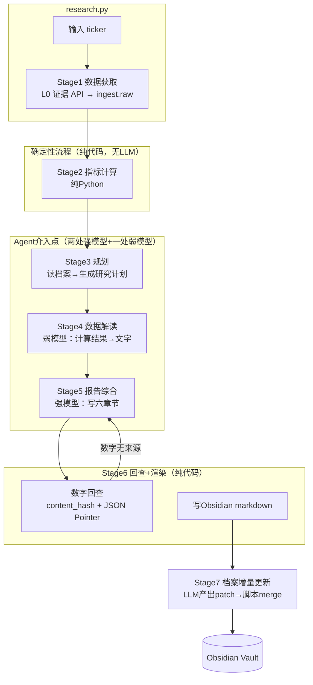

# EquityDeep 技术设计文档

**对应 PRD**: EquityDeep v1.1（按 ADR-022 修订）
**版本**: v1.1（可实现版，按 ADR-022 修订）
**归属**: EquityDeep 是本统一研究平台的**工作面 1（纵向深研）** —— 见 [ADR-022](../../adr/adr-022-unified-research-platform.md)（取代 [ADR-021](../../adr/adr-021-equitydeep-research-layer.md)）；顶层产品定义见 [PRODUCT.md](../../PRODUCT.md)；工作面 1 详案见 [RESEARCH.md](../../RESEARCH.md)；本规格的历史待改进项（含原 §3.1 回查脚本 P0 缺陷）见 [ODR-047](../../odr/odr-047-equitydeep-integration-audit.md)

> **ADR-022 修订说明**（v1.0 → v1.1）
>
> | 维度 | v1.0（原假设） | v1.1（ADR-022） |
> |---|---|---|
> | 数据库 | 无 DB，文件系统即数据库 | 叙事=vault markdown（事实源）；结构化状态=PG `research.*`（markdown 的确定性投影，可 DROP 重建）；原始证据=PG `ingest.raw` |
> | 部署 | 本机 `pip install -e .`，无 docker | 保留本机 CLI，另加 `equitydeep-research` worker 容器（共享平台 PostgreSQL，无对外端口） |
> | 取数 | 自行调用 akshare 并落本地快照 | **严格单一入口**：经 L0 只读证据 API 取数，原始响应归档 `ingest.raw`（`content_hash` 唯一键） |
> | 数字回查 | grep 本地快照 JSON 文本子串（ODR-047 P0 假阳性） | `citation = {source, dataset, key, as_of, content_hash}` + JSON Pointer 精确命中 |
>
> **不变项**：Python 3.11 / 固定 7-stage pipeline / 逐数溯源 / 三个硬承诺（数字可信·研究复利·观点分层）/ 非目标红线 / **vault markdown 仍是研究叙事的事实源**。

---

## 1. 架构总览

### 1.1 核心决策：固定 Pipeline，Agent 只做判断

**设计哲学**：研究流程是确定的（取数→算→写），不存在"需要动态决定下一步"的场景。固定 pipeline 每个阶段可独立测试、独立重跑。**这把 agent 系统问题降维成"脚本 + 3 次 LLM 调用"问题，是一个人可维护的复杂度。**



**为什么不用 LangGraph / 自由 agent 循环**：研究流程确定，自由循环引入不可控性；固定 pipeline 每阶段可独立测试、独立重跑。追问（F5）是独立的轻量循环，不进 pipeline。

### 1.2 核心决策：vault 是叙事事实源，Obsidian 是工作面（ADR-022 修订）

> **v1.0 原决策**是"文件系统即数据库"。**ADR-022 修订为**：vault markdown 仍是**研究叙事的事实源**（不可重建、人机共写），但**结构化状态**下沉到平台 PostgreSQL 的 `research.*` schema（作为 markdown 的确定性投影，可随时 DROP 重建），**原始证据**归档到 `ingest.raw`（经 L0 只读证据 API 获取，不再自抓自存）。

```
equitydeep/                    # 代码库
├── vault/                     # Obsidian Vault（用户打开这个目录）
│   └── 600519/                # 每票一个目录
│       ├── _profile.md        # L1研究档案（人+agent共写，叙事事实源）
│       └── reports/
│           └── 2025-11-20.md  # 完整研报（脚注指向 content_hash）
└── ...                        # 原始快照 / 结构化状态 均在平台 PG

平台 PostgreSQL
├── ingest.raw                 # A 类：原始源响应（content_hash 唯一键，只追加）
│                               #   ← 原 vault/snapshots/*.json 迁移至此
└── research.*                 # E 类：研究结构化状态（markdown 的确定性投影）
    ├── research.profile       #   档案头/结论/疑点的结构化镜像
    ├── research.report        #   研报元数据 + citation 元组
    └── research.citation      #   {source, dataset, key, as_of, content_hash}
```

**好处**（ADR-022 后仍成立的部分）：
1. 记忆系统 = 用户可直接读写的 markdown——人机共用同一份记忆，天然双向
2. 溯源 = markdown 脚注指向 `content_hash`，经 `GET /api/evidence/{content_hash}` 取回唯一原始记录（跨票共享，不再逐票重复存）
3. Obsidian 的搜索/链接/图谱视图白拿；平台 DB 另提供跨票/跨期的结构化检索
4. 备份 = git（vault）+ PG 备份（`research.*` 可重建、`ingest.raw` 只追加）

---

## 2. 数据设计

### 2.1 L1 研究档案（`_profile.md`）——记忆的核心

```markdown
---
ticker: "600519"
name: "贵州茅台"
last_researched: "2025-11-20"
needs_review: false          # 财报发布后定时任务翻成true
review_reason: ""            # 触发复核的原因
---

## 基本盘（半稳定，人工+agent维护）
- 商务：白酒龙头，批价体系是核心指标
- 关键外部变量：消费税改革（悬而未决）

## 结论
### C1 渠道话语权强
> 预收款（合同负债）占收入比长期>30%且稳定，经销商先款后货

- **依据**: `citation{content_hash, /data/合同负债}`（经证据 API 取回）
- **as_of**: 2025Q3 ｜ **置信**: 高 ｜ **状态**: 有效

### C2 ~~存货周转隐忧~~（已被C3推翻，2025-11-20）
> 原判断：2024Q4周转率下降存疑 → 业绩会确认系渠道蓄水，2025Q3已回升

## 疑点
- [ ] Q1：批价对一批价价差扩大至400元（2025-11提出，status: open）
- [x] Q2：存货周转异常（2025-08提出 → 2025-11业绩会+Q3数据解决）

## 产业链线索（P2预留字段）
- 上游：高粱/包装（占比待查）
- 下游：经销商体系（前五大集中度年报未披露姓名）
```

**机制**：
- **写入**：Stage7 由 LLM 产出结构化增量，脚本确定性 merge——**绝不自动总结对话**
- **失效**：财报/重大公告事件 → `needs_review=true`，下次研究时档案头部强制提示 agent"以下结论需用新数据重验"
- **人的编辑**：用户直接改 md（勾选疑点、加备注、删结论），agent 下次读取时所见即用户所改

### 2.2 原始证据（`ingest.raw`，ADR-022 修订）

> **v1.0 原设计**为本地 `snapshots/*.json`。**ADR-022 起**原始响应归档到平台 PostgreSQL 的 `ingest.raw` 表（`content_hash` 唯一键），Stage1 经 L0 只读证据 API 获取，避免跨票/跨工作面重复存储。

```sql
-- ingest.raw（A 类：原始源响应，只追加，不修改）
content_hash  TEXT PRIMARY KEY,   -- 源响应内容的 SHA-256（内容坐标，跨票去重）
source        TEXT NOT NULL,      -- 如 'akshare'
dataset       TEXT NOT NULL,      -- 如 'stock_financial_abstract_ths'
key           TEXT NOT NULL,      -- 如 '600519'
as_of         TIMESTAMPTZ,        -- 源报告期/抓取时点
payload       JSONB NOT NULL,     -- 原始返回，字段名不改（保留源语义）
fetched_at    TIMESTAMPTZ NOT NULL
```

```jsonc
// payload（ingest.raw.payload）示例
{
  "ticker": "600519",
  "report_period": "2025-09-30",
  "data": {
    "营业总收入": 127854000000,
    "归母净利润": 60276000000,
    "货币资金": 185230000000
  }
}
```

**规则**：
1. 原始返回**不改字段名直接归档**（回查时按 JSON Pointer 精确定位）
2. 同一 `(dataset, key, as_of)` 重复拉取 → 若 `content_hash` 相同则天然去重（不落第二份）；不同则两条并存（restatement 可对比）
3. 计算层读 `ingest.raw` 算衍生指标，衍生值写入 `research.*`（同样参与回查）

### 2.3 研报与溯源

```markdown
营业总收入1278.5亿[^fn1]，同比增长15.7%[^fn2]。

[^fn1]: `citation{a5f3…, akshare, stock_financial_abstract_ths, 600519, 2025-09-30}` → `/data/营业总收入`
[^fn2]: 由 C2 同期 `citation{…}` 计算，见 `research.derived/growth.json`
```

> **溯源机制（ADR-022）**：脚注绑定 `content_hash`（内容坐标），读者可经 `GET /api/evidence/{content_hash}` 取回**唯一**原始记录，并可用 JSON Pointer（`/data/营业总收入`）精确定位字段——取代 v1.0 的"grep 文本子串"，从架构上消除 [ODR-047](../../odr/odr-047-equitydeep-integration-audit.md) 的 P0 假阳性缺陷。

---

## 3. 关键机制实现

### 3.1 数字回查（质量护城河，ADR-022 修订）

> **v1.0 原实现**把报告文本与快照 JSON **归一化成字符串后做子串匹配**（`repr_num in snapshot_text`）——这是 [ODR-047](../../odr/odr-047-equitydeep-integration-audit.md) 的 **P0 缺陷**：任何恰好出现的数字子串都会"通过"，即便它不是该字段的值（假阳性）。
>
> **ADR-022 修订**：校验对象从"文本子串"升级为 **`citation` 元组 + JSON Pointer**。报告中的每个数字必须携带结构化引用，回查即按引用**精确取值比对**。

```python
from decimal import Decimal

def check_report(report_md: str, evidence_api) -> list:
    """校验报告中每个数字：按 citation 精确取值比对，而非文本子串匹配。"""
    errors = []
    for num in extract_numbers(report_md):          # 每个数字解析出 citation 引用
        if not num.citation:
            errors.append(f"数字 {num.text} 缺 citation")
            continue
        c = num.citation                             # {source, dataset, key, as_of, content_hash}
        raw = evidence_api.get(c.content_hash)       # GET /api/evidence/{content_hash}
        if raw is None:
            errors.append(f"数字 {num.text}: content_hash {c.content_hash[:8]} 不存在")
            continue
        actual = json_pointer(raw.payload, num.pointer)   # 如 /data/营业总收入
        if actual is None:
            errors.append(f"数字 {num.text}: JSON Pointer {num.pointer} 未命中")
        elif Decimal(str(actual)) != num.value:           # 精确值比对（含单位换算）
            errors.append(f"数字 {num.text}: 快照值为 {actual}，不一致")
    return errors
```

**策略**：
- **精确取值，不做宽匹配**——`citation` 定位到 `(dataset, key, as_of, content_hash)` 后按 JSON Pointer 取单一字段，与该数字**数值比对**（百分比/倍数允许由两个 citation 计算得出，走 `research.derived` 兜底）。
- 回查失败 → 报告退回 Stage5 重写一次并注入错误清单；再失败 → 该数字替换为 `[数据待核]`。
- 相比 v1.0，**假阳性被架构性消除**（子串匹配不复存在），且校验可跨票复用（证据在 `ingest.raw`，不依赖本地文件树）。

### 3.2 记忆增量写入

```python
# Stage7 的输出契约（LLM 必须按此 schema 返回）
MemoryDelta = {
  "new_conclusions": [{"id": "C3", "title": "...", "body": "...",
                        "basis": "citation{content_hash, pointer}", "as_of": "2025Q3", "confidence": "高"}],
  "new_questions":   [{"id": "Q1", "text": "批价价差扩大原因"}],
  "resolved":        [{"question_id": "Q2", "resolution": "业绩会确认+Q3数据",
                        "evidence": "citation{content_hash, pointer}"}],
  "overturned":      [{"conclusion_id": "C2", "by": "C3", "reason": "..."}]
}
```

**Merge 脚本**：确定性应用——追加章节/勾选 checkbox/给被推翻结论加删除线和标注。patch 以追加方式写入档案末尾的"## 更新日志"节，可 git 回滚。

> **ADR-022**：merge 完成后，脚本把档案的**结构化镜像**投影到 PG `research.profile`（结论/疑点/头字段）。该投影是 markdown 的确定性函数，**可 DROP 重建**；vault markdown 始终是事实源，投影仅服务于跨票检索与飞轮消费。

### 3.3 追问循环（F5）

```python
# 复用当前研究的 stage_summaries + citations 作为初始上下文
# 50 行内的标准 tool-loop：
while True:
    resp = llm.chat(history + [{"role": "user", "content": q}], tools=DATA_TOOLS)
    if not resp.tool_calls:
        return resp.text
    for call in resp.tool_calls:
        result = TOOLS[call.name](**call.args)   # 同pipeline的工具，现拉现算
        # result 经 L0 证据 API 归档 ingest.raw → 产出 citation 回填 history
        # 追问中产生的数字同样进 citation，回答结束跑同一套回查（§3.1）
```

### 3.4 研报 PDF 解析（F7）

```
vault/inbox/*.pdf
  → pdfplumber 抽文本
  → LLM 按固定 schema 抽取：{观点: [{论断, 依据页码, 立场}],
                              供应链: [{甲方, 乙方, 关系, 占比?, 置信}],
                              盈利预测: [...]}
  → 写入对应股票档案的"外部观点"和"产业链线索"节
  → 每条带 [来源: 用户导入, 文件名, 页码]
```

---

## 4. 技术选型（最简栈，ADR-022 修订）

| 层 | 选型 | 理由 |
|---|---|---|
| 语言 | Python 3.11 | 单语言全线 |
| 编排 | **手写 pipeline（无框架）** | 7 个 stage 函数顺序调用，约 200 行，任何 stage 可独立重跑调试 |
| LLM | 强：Claude Sonnet / DeepSeek-R1；弱：DeepSeek-V3 | 强模型仅 Stage3/5（约 2 次），弱模型 Stage4/7/PDF 解析 |
| 数据 | **L0 只读证据 API**（底层源 akshare/tushare 由数据面统一摄取） | 严格单一入口；M1 抽检达标才继续 |
| 计算 | pandas（手写指标库） | 杜邦/现金流质量/同业表/简化 DCF，纯函数 |
| 存储 | **叙事=vault markdown（git）；结构化状态=PG `research.*`（投影，可重建）；原始证据=PG `ingest.raw`** | 见 §1.2；不重复存储 |
| 交互 | CLI（rich 库美化）+ Obsidian | 无 Web |
| 追踪 | 简版：每次研究一个 `runs/{ts}/trace.jsonl` | P1 再接 LangFuse 自部署 |
| 部署 | 本机 CLI（`pip install -e .`）**+ `equitydeep-research` worker 容器**（共享平台 PG，无对外端口） | 见 [ADR-022](../../adr/adr-022-unified-research-platform.md) §4 |

---

## 5. 成本模型

固定调用次数（pipeline 的好处——成本可预算）：

| Stage | 模型档 | 次数 | tokens/次 | 单票成本 |
|---|---|---|---|---|
| 3 规划 | 强 | 1 | ~8K in / 1K out | ¥0.6 |
| 4 数据解读 | 弱 | 3 | ~10K in / 2K out | ¥0.3 |
| 5 报告综合 | 强 | 1 | ~15K in / 6K out | ¥1.5 |
| 回查重写（偶发） | 强 | ≤1 | ~8K / 5K | ¥0.6 |
| 7 档案增量 | 弱 | 1 | ~4K / 1K | ¥0.1 |
| **合计** | | | | **≈¥3.1 ✅** |

---

## 6. 项目结构

```
equitydeep/
├── pyproject.toml
├── equitydeep/
│   ├── cli.py            # research/ask 命令入口
│   ├── pipeline.py       # run_research(ticker): 7 个 stage 编排
│   ├── stages/
│   │   ├── fetch.py      # Stage1: L0 证据 API → ingest.raw（可独立跑）
│   │   ├── compute.py    # Stage2: 指标计算 → research.derived
│   │   ├── plan.py       # Stage3: 读档案→研究计划
│   │   ├── interpret.py  # Stage4: 数字→文字
│   │   ├── synthesize.py # Stage5: 报告生成
│   │   ├── check.py      # Stage6: 回查（citation+JSON Pointer）+渲染
│   │   └── memory.py     # Stage7: 增量 merge + 投影 research.profile
│   ├── evidence.py       # L0 只读证据 API 客户端（get by content_hash）
│   ├── store.py          # vault markdown 读写 + research.* 投影
│   ├── tools.py          # 数据/计算函数（MCP 兼容 schema 导出）
│   ├── ask.py            # F5 追问循环
│   ├── pdf_import.py     # F7 研报解析
│   └── prompts/          # 各 stage 的 prompt 模板（改前必须跑 evals）
├── evals/
│   ├── golden/{ticker}.yaml   # 10 票金标准
│   ├── run_evals.py
│   └── REPORT.md         # 回归结果（人工检查清单）
└── vault/                # Obsidian 打开此目录
```

---

## 7. 评估体系

### 7.1 金标准集

```yaml
# evals/golden/600519.yaml
ticker: 600519
key_facts:            # 必须命中的数字（报告期锚定）
  - metric: 2025Q3营业总收入
    value: 127854000000
    tolerance: 0.01
must_cover:           # 必须覆盖的要点
  - "合同负债占比及其含义"
  - "批价体系风险"
known_traps:          # 陷阱题：容易幻觉的点
  - "茅台毛利率（勿用老数据，2025口径）"
```

### 7.2 评估流程与门禁

```
run_evals.py
  → 跑 10 票完整研究
  → 数字比对自动打分（命中/容差内/未命中）
  → 回查覆盖率
  → 覆盖要点语义匹配
  → 输出 REPORT.md
```

**门禁规则**：改 `prompts/` 下任何文件必须先跑回归，准确率下降即回滚。

---

## 8. 风险与对策

| 风险 | 对策 |
|---|---|
| 底层数据源（akshare 等）质量不达标 | **M1 硬门槛**：抽检 10 票×20 数字错误率>2% → 换 tushare/付费源。摄取由 L0 数据面统一负责，工作面不感知源切换 |
| L0 证据 API 不可达 | 降级为只读研究：`equitydeep evidence --cache` 走本地 `ingest.raw` 只读缓存；恢复后补写缺失证据 |
| 报告综合丢信息 | Stage5 允许按 `citation.content_hash` 重取原始证据（证据在 `ingest.raw`，重取零成本） |
| 记忆污染（错误结论沉淀） | 增量必带 `citation` 依据 + as_of；用户在 Obsidian 可直接删；needs_review 强制过期。vault markdown 为唯一事实源，`research.*` 投影可 DROP 重建，杜绝双写漂移 |
| 长报告上下文溢出 | Stage 间只传结构化摘要+`citation` 引用；追问时按需经证据 API 现读（不靠记忆） |
| `ingest.raw` 无限增长 | adr-022 Q-2：冷热分层（近期热存 PG / 历史归档对象存储，`content_hash` 仍为唯一键） |

---

## 9. 第一个行动（今天，ADR-022 修订）

M1 质量门禁不变（10 票 × 20 数字，错误率 <2%），但**取数路径改为经 L0 数据面统一摄取**（工作面不再自抓 akshare）：

```bash
# 1) 经 L0 数据面摄入 10 票财务数据（由 data-service 统一摄取 → ingest.raw）
equitydeep fetch --tickers 600519,000858,601318,300750,002594,688981,600036,000333,601012,002415 \
                 --dataset stock_financial_abstract_ths

# 2) 抽检：人工对照最新定期报告，逐数核验（走 evidence API，非本地 grep）
equitydeep evidence audit --tickers <same> --sample-size 20
```

**判定**：对照最新定期报告核对 20 个数字，错误率<2% → M1 通过，继续往下做；>2% → 先在 L0 数据面解决数据源问题（换源对工作面透明），再谈其他。
